# BPUT Hackathon 2026 — Presentation Slide Deck Architecture & Reference Guide

> **System:** SafeSync — AI-Powered Workplace Safety Monitoring System  
> **Problem Statement:** PS06 — Build a prototype AI system that detects safety gear compliance  
> **Organizers:** Software Technology Parks of India (STPI) & EmTek  
> **Team:** XERSES  
> **Presentation File:** [`SafeSync-BPUT-HACKATHON-2026.pptx`](./SafeSync-BPUT-HACKATHON-2026.pptx)  
> **Final 10-Slide Executive Structure:** [**BPUT-HACKATHON-2026/README2.md**](./README2.md)  
> **Full Architecture & Layout Breakdown:** 13 Comprehensive Slide Specifications below  

---

## Executive Summary of the Presentation

The presentation deck [`SafeSync-BPUT-HACKATHON-2026.pptx`](./SafeSync-BPUT-HACKATHON-2026.pptx) translates the SafeSync engineering codebase into a professional, visual-first presentation for the BPUT Hackathon 2026 jury. It strictly follows the real project implementation, verified test data, and architectural guarantees without artificial marketing claims or AI development chronology.

```
Slide Structure Overview:
├── Slide 01: Title & Hackathon Context
├── Slide 02: The Industrial Challenge (Problem Statement PS06)
├── Slide 03: The Solution — SafeSync Overview
├── Slide 04: End-to-End System Architecture Pipeline
├── Slide 05: AI Detection Model & Canonical 7-Class Ontology
├── Slide 06: PPE Compliance & Anatomical Spatial Association
├── Slide 07: Environmental Hazard Monitoring (Fire & Smoke)
├── Slide 08: Real-Time Security Operations Center (SOC) Dashboard
├── Slide 09: Explainable Risk Scoring, Alerts & Evidence Archival
├── Slide 10: Production-Grade Technology Stack
├── Slide 11: Testing, Verification & Empirical Scorecard
├── Slide 12: Business Impact & Future Engineering Roadmap
└── Slide 13: Project Submission Summary & Conclusion
```

---

## Comprehensive Technical Slide Descriptions

---

### Slide 1: Title & Hackathon Context

#### 1. Purpose & Strategic Focus
Establishes project identity, competitive domain, organizing bodies, and core product value proposition. Highlights the high-contrast industrial safety branding.

#### 2. Visual Layout & Color Accents
- **Canvas:** Deep Dark Slate (`#0F172A`)
- **Accent Strip:** Left vertical glowing emerald bar (`#10B981`)
- **Header Badge:** Pill container in dark navy with cyan text (`#38BDF8`): `BPUT HACKATHON 2026 • PROBLEM STATEMENT PS06`
- **Typography:**
  - Main Title: `SafeSync` in 46pt Bold White (`#F8FAFC`)
  - Subtitle: `AI-Powered Workplace Safety Monitoring & Compliance Platform` in 18pt Emerald Green (`#10B981`)
  - Tagline Pill: `Detect • Understand • Alert • Protect` in dark green container with safety green text

#### 3. Content Breakdown
- **Capabilities Container (Left Card):**
  - Real-Time PPE Compliance: Helmets, Safety Vests, Gloves, Footwear
  - Anonymous Worker Tracking: ByteTrack 8-State Kalman Trajectories
  - Early Hazard Confirmation: Dual-Channel Fire & Smoke Tracking
  - Explainable Risk Governance: 0–100 Deterministic Scoring & Cooldowns
  - Tamper-Evident Evidence: Visual Snapshots with SHA-256 Checksums
  - Live Operations Center: WebSocket Streaming to React 18 SOC Dashboard
- **Team & Partner Metadata (Right Card):**
  - **Team:** XERSES
  - **Organizers:** Software Technology Parks of India (STPI) & EmTek
  - **Hackathon:** BPUT Hackathon 2026
  - **Problem Statement:** PS06 — Vision-Based Industrial Safety Gear Compliance
  - **Repository:** `https://github.com/SMRU08/SafeSync.git`

#### 4. High-Level System Context Diagram
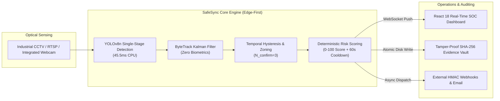

---

### Slide 2: The Industrial Challenge (PS06)

#### 1. Purpose & Strategic Focus
Breaks down the operational failure modes of conventional manual and automated safety monitoring, justifying the need for an edge-intelligent computer vision system.

#### 2. Visual Layout & Composition
- **Header:** Category Pill `[PROBLEM STATEMENT PS06]`, Title: *The Industrial Safety Challenge: Human Monitoring Bottlenecks*
- **Layout:** 4 vertically oriented problem dimension cards ($200 \times 320$ pt) spanning the width with dedicated color highlights.
- **Bottom Callout Panel:** Full-width summary card in dark slate with green accent border.

#### 3. Detailed Card Content
1. **1. Observer Fatigue (Amber Card):**
   - *Perceptual Vigilance Decay:* Human safety officers monitoring multi-screen CCTV feeds experience cognitive vigilance decay within 20–30 minutes of continuous observation. Subtle PPE lapses go unnoticed during high-activity factory operations.
2. **2. Detection Delays (Red Card):**
   - *Delayed Emergency Triggers:* Traditional smoke detectors and thermal sensors only engage after combustion products rise to ceiling height, sacrificing vital developmental seconds before emergency response can begin.
3. **3. Spot-Check Blindness (Amber Card):**
   - *Intermittent Enforcement:* Manual floor inspections provide only isolated spot-checks. Workers frequently remove mandatory gear immediately after auditors leave, creating extensive unmonitored risk windows.
4. **4. Audit Disputes (Cyan Card):**
   - *Lack of Verified Evidence:* Post-incident regulatory inquiries often suffer from missing footage, ambiguous timestamps, or unverified logs, leading to disputed liability and unresolved hazard causes.

#### 4. Operational Failure Mode vs Automated Vision Flowchart
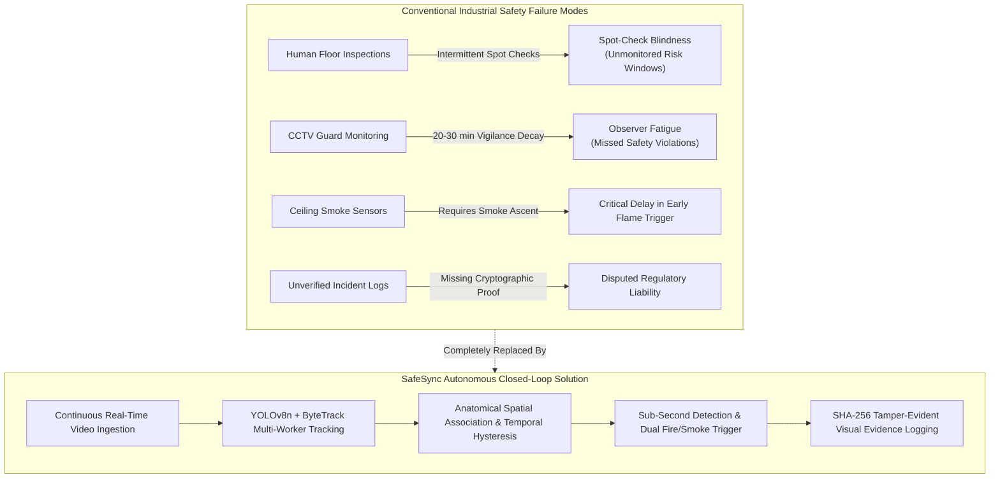

---

### Slide 3: The Solution — SafeSync Overview

#### 1. Purpose & Strategic Focus
Presents SafeSync's architectural philosophy, demonstrating how the platform addresses each challenge through decoupled vision, privacy by design, and strict ambiguity tolerance.

#### 2. Visual Layout & Composition
- **Header:** Category Pill `[SYSTEM OVERVIEW]`, Title: *SafeSync: Continuous, Edge-Intelligent Safety Governance*
- **Top Section:** 3 large feature pillar cards ($270 \times 250$ pt).
- **Bottom Section:** 4 high-contrast KPI metric callout tiles ($200 \times 120$ pt) featuring large 28pt numbers.

#### 3. Detailed Content
- **Pillar 1: Decoupled Vision Pipeline (Cyan):**
  - Object detection is strictly isolated from anatomical association and temporal state persistence. Eliminates noisy false alarms from bare heads, hair textures, or yellow clothing.
- **Pillar 2: Zero-Biometric Privacy (Green):**
  - Continuous tracking uses temporary integer IDs (`Track #101`) via ByteTrack Kalman filters. Zero facial recognition, zero biometric capture, and zero PII stored, ensuring full privacy regulation compliance.
- **Pillar 3: Ambiguity Invariant (Amber):**
  - Foundational rule: **`UNKNOWN != VIOLATION`**. Occlusions, machinery obstruction, and frame boundary clipping strictly never trigger alarms. Violations require verified absence over consecutive confirmation frames.
- **KPI Metrics Grid:**
  - `7 Classes`: Unified safety ontology (Person, Helmet, Vest, Gloves, Footwear, Fire, Smoke)
  - `45.5 ms`: Mean end-to-end CPU pipeline latency (~22–24 FPS on commodity CPU hardware)
  - `N = 3`: Consecutive frames confirmation threshold eliminating single-frame false violation flickers
  - `SHA-256`: Cryptographic checksum calculated upon image snapshot write for tamper-evident auditing

#### 4. Decoupled Core Pillars Flowchart
```mermaid
flowchart TD
    subgraph P1["Pillar 1: Decoupled Vision"]
        DET["Raw Object Detection<br/>(Finds positive gear)"] --> ASSOC["Anatomical Spatial Associator<br/>(Calculates body IoU)"]
        ASSOC --> TEMP["Temporal State Machine<br/>(Debounces over 3 frames)"]
    end

    subgraph P2["Pillar 2: Zero-Biometric Privacy"]
        PII["Camera Video Frame"] --> ANONYMOUS["ByteTrack 8-State Kalman Tracker"]
        ANONYMOUS --> ID["Transient Track ID (#101)<br/>Zero Facial Rec • Zero PII"]
    end

    subgraph P3["Pillar 3: Ambiguity Invariant"]
        OCCL["Worker Obstructed / Clipped"] --> UNK["State: UNKNOWN<br/>(Neutral Gray Badge)"]
        UNK --> RULE["Invariant: UNKNOWN != VIOLATION<br/>Strictly ZERO False Alarms"]
    end
```

---

### Slide 4: End-to-End System Architecture Pipeline

#### 1. Purpose & Strategic Focus
Visualizes the complete multi-stage software architecture, tracing a video frame from camera capture through inference, tracking, temporal validation, risk governance, and storage.

#### 2. Visual Layout & Composition
- **Header:** Category Pill `[ENGINEERING ARCHITECTURE]`, Title: *Decoupled Multi-Subsystem Processing Pipeline*
- **Central Diagram:** 6 horizontal pipeline cards ($135 \times 270$ pt) connected sequentially with directional arrows.
- **Bottom Panel:** Architectural fault isolation guarantee container ($860 \times 95$ pt).

#### 3. Detailed Pipeline Stages
1. **1. Ingestion:** Heterogeneous source support (IP/RTSP cameras, USB webcams, recorded video files) managed via thread-isolated `CameraWorker` with bounded exponential backoff reconnection.
2. **2. AI Vision:** Ultralytics YOLOv8n multi-task detector ($384\times 384$) evaluating 7 canonical classes with cryptographic SHA-256 weight verification on startup.
3. **3. Tracking & Association:** ByteTrack 8-state Kalman Filter motion estimation and spatial anatomical associator dividing worker bounding boxes into Head, Torso, Hands, and Feet zones.
4. **4. Temporal Validation:** Dual-channel state machine requiring $N_{\text{confirm}} = 3$ frames for PPE absence and $N_{\text{confirm}} = 5$ frames for combustion hazards.
5. **5. Governance:** Deterministic $0 \dots 100$ risk scoring engine, in-memory alert deduplication, 60-second cooldown windows, and formal incident lifecycle management.
6. **6. Storage & UI:** Relational SQLite in Write-Ahead Logging (WAL) mode, cryptographic SHA-256 evidence archival, React 18 SOC dashboard, and real-time WebSocket push.
- **Fault Isolation Principles:**
  - Complete worker thread isolation: one failing camera stream never crashes neighboring cameras.
  - Asynchronous background alert dispatch: external webhook/SMTP drops never block the video inference loop.
  - Concurrency resilience: 5,000 ms SQLite busy timeout eliminates edge write lock contention.

#### 4. End-to-End System Processing Pipeline Flowchart
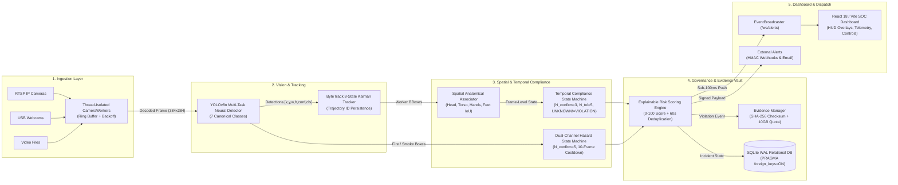

---

### Slide 5: AI Detection Model & Canonical 7-Class Ontology

#### 1. Purpose & Strategic Focus
Details the machine learning foundation, training dataset provenance, canonical class definitions, cryptographic model registry, and actual model validation performance.

#### 2. Visual Layout & Composition
- **Header:** Category Pill `[AI & COMPUTER VISION]`, Title: *YOLOv8n Multi-Task Neural Detector & 7-Class Ontology*
- **Left Column:**
  - Top Card ($370 \times 240$ pt): Canonical 7-class ontology definitions and negative absence exclusion philosophy.
  - Bottom Card ($370 \times 135$ pt): Model registry specification and SHA-256 verification workflow.
- **Right Column:** Large visual showcase card ($470 \times 390$ pt) displaying an **actual validation prediction image** (`val_batch0_pred.jpg`) generated by the model during evaluation.

#### 3. Detailed Technical Content
- **The Canonical 7 Classes:**
  - `0: person` $\rightarrow$ Worker identity & trajectory tracking
  - `1: helmet` $\rightarrow$ Head protective equipment
  - `2: safety_vest` $\rightarrow$ Torso high-visibility visibility gear
  - `3: gloves` $\rightarrow$ Hand mechanical & chemical protection
  - `4: safety_footwear` $\rightarrow$ Protective boots & safety shoes
  - `5: fire` $\rightarrow$ Open flame & active combustion
  - `6: smoke` $\rightarrow$ Visible smoke plume & emissions
- **Core Model Invariants:**
  - Single-stage positive object detection; absence is derived anatomically rather than learned as noisy negative classes.
  - Active Checkpoint: `models/detection/ppe_fire_smoke_v2/weights/best.pt`
  - Cryptographic SHA-256: `490a4867d0c9c848ed38e9d5b196a21f925371e3019079b6b7e30c0a5084b2f3`
  - Dataset: 22,453 normalized images across 51,195 verified annotations (zero cross-split leakage).
  - Benchmark Performance (conf = 0.25): Baseline V1 mAP@50 = 7.15% $\rightarrow$ Production V2 mAP@50 = **25.23%** (3.61× improvement), Precision: 37.60%, Recall: 37.44%.

#### 4. Neural Detection Architecture & 7-Class Output Flowchart
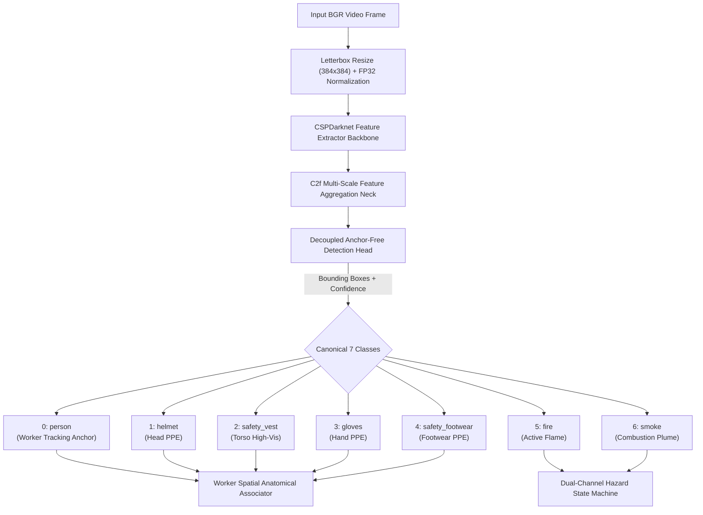

---

### Slide 6: PPE Compliance & Anatomical Association

#### 1. Purpose & Strategic Focus
Explains the anatomical body zoning logic that translates raw object detections into worker PPE compliance states without false alarms, and details the temporal debouncing state machine.

#### 2. Visual Layout & Composition
- **Header:** Category Pill `[COMPLIANCE LOGIC]`, Title: *Anatomical Spatial Association & Multi-Frame Temporal Validation*
- **Left Column:** Anatomical body zoning specification card ($420 \times 390$ pt).
- **Right Column:**
  - Top Card ($420 \times 220$ pt): Temporal confirmation thresholds and tolerance windows.
  - Bottom Card ($420 \times 155$ pt): Mandatory occlusion rule (`UNKNOWN != VIOLATION`).

#### 3. Detailed Technical Content
- **Anthropometric Spatial Zoning:**
  - **Head Zone (Top 0% – 25% height):** Bounding box center of `helmet` must reside within top 25% of worker height.
  - **Torso Zone (20% – 70% height):** Bounding box of `safety_vest` must maintain $\ge 40\%$ horizontal overlap with worker body.
  - **Hands Zone (Lateral 40% – 75% height):** Target for protective `gloves`.
  - **Feet Zone (Bottom 75% – 100% height):** Target for `safety_footwear`.
  - **Mutual Exclusion Guarantee:** Overlapping workers in close proximity have PPE assigned to the nearest anatomical centroid via Euclidean IoU distance, preventing double-counting.
- **Temporal State Machine Rules:**
  - $N_{\text{confirm}} = 3$ consecutive missing frames required before transitioning from provisional to confirmed `ABSENT`.
  - $N_{\text{tol}} = 5$ frames tolerance window absorbs brief glance-away occlusions without dropping state.
  - Boundary clipping & partial occlusion immediately lock state to `UNKNOWN`.
  - **`UNKNOWN != VIOLATION` Rule:** Occlusions and partial views strictly yield zero violation events and zero operator alerts; rendered as neutral gray on the dashboard HUD.

#### 4. Spatial Body Zoning Model & State Transition Flowchart
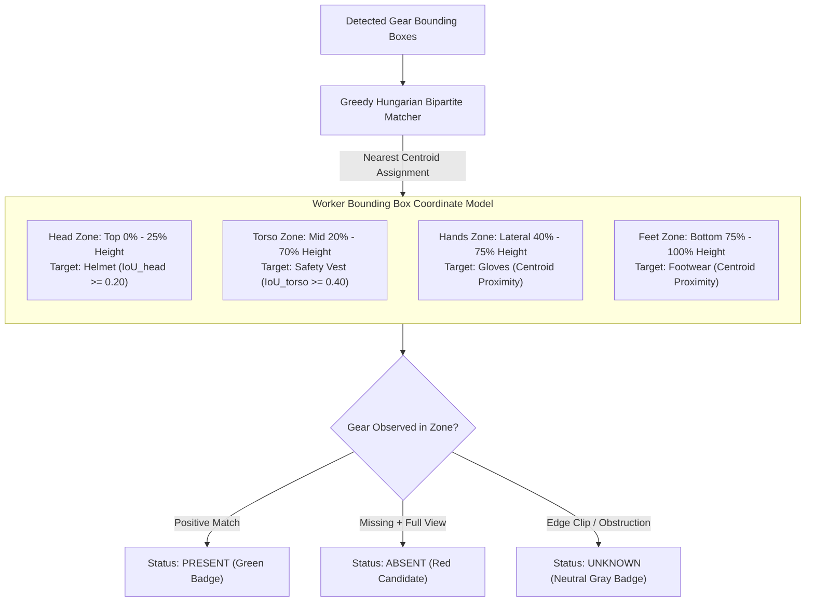

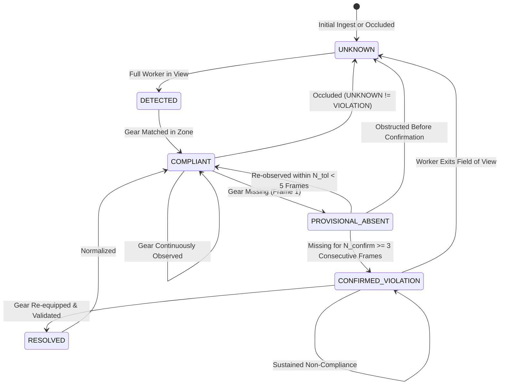

---

### Slide 7: Environmental Hazard Monitoring (Fire & Smoke)

#### 1. Purpose & Strategic Focus
Presents the decoupled dual-channel combustion detection pipeline, multi-modal relationship modes, and false positive mitigation strategies for harsh industrial environments.

#### 2. Visual Layout & Composition
- **Header:** Category Pill `[ENVIRONMENTAL HAZARDS]`, Title: *Decoupled Dual-Channel Combustion Detection & Multi-Modal Verification*
- **Left Column:**
  - Top Card ($420 \times 240$ pt): Decoupled hazard tracking architecture and temporal confirmation.
  - Bottom Card ($420 \times 135$ pt): False positive mitigations for boiler steam and forklift strobes.
- **Right Column:** Multi-modal hazard relationship modes card ($420 \times 390$ pt) highlighted in emergency red.

#### 3. Detailed Technical Content
- **Decoupled Architecture:**
  - Shared convolutional backbone with YOLOv8 for edge CPU efficiency, routing directly to independent spatial hazard trackers (`HAZARD-0001`, `HAZARD-0002`).
  - Multi-frame confirmation ($N_{\text{confirm}} = 5$ frames, ~150–200 ms) filters out 1-frame welding arcs, flashlight flares, and reflections.
  - Clearing state machine requires 10 consecutive clear frames before confirming suppression.
- **Multi-Modal Relationship Modes:**
  1. `FIRE_AND_SMOKE` (**CRITICAL**): Simultaneous flame and plume detection in shared zone (high-intensity active combustion). Triggers full-screen visual alarms, sirens, and immediate dispatches.
  2. `FIRE_ONLY` (**HIGH**): Confirmed flame without visible smoke (clean fuel combustion, electrical arc, early flare).
  3. `SMOKE_ONLY` (**HIGH**): Confirmed smoke plume without visible flame (smoldering materials or concealed fire).
  4. `NO_HAZARD` (**NORMAL**): Zero combustion signatures detected.
- **Industrial False Positive Hardening:** Configurable polygon exclusion masks (`roi_polygons`) allow masking known stationary boiler blowdown steam vents; neural detector fine-tuned on yellow/orange forklift warning lights.

#### 4. Dual-Channel Combustion State Machine Flowchart
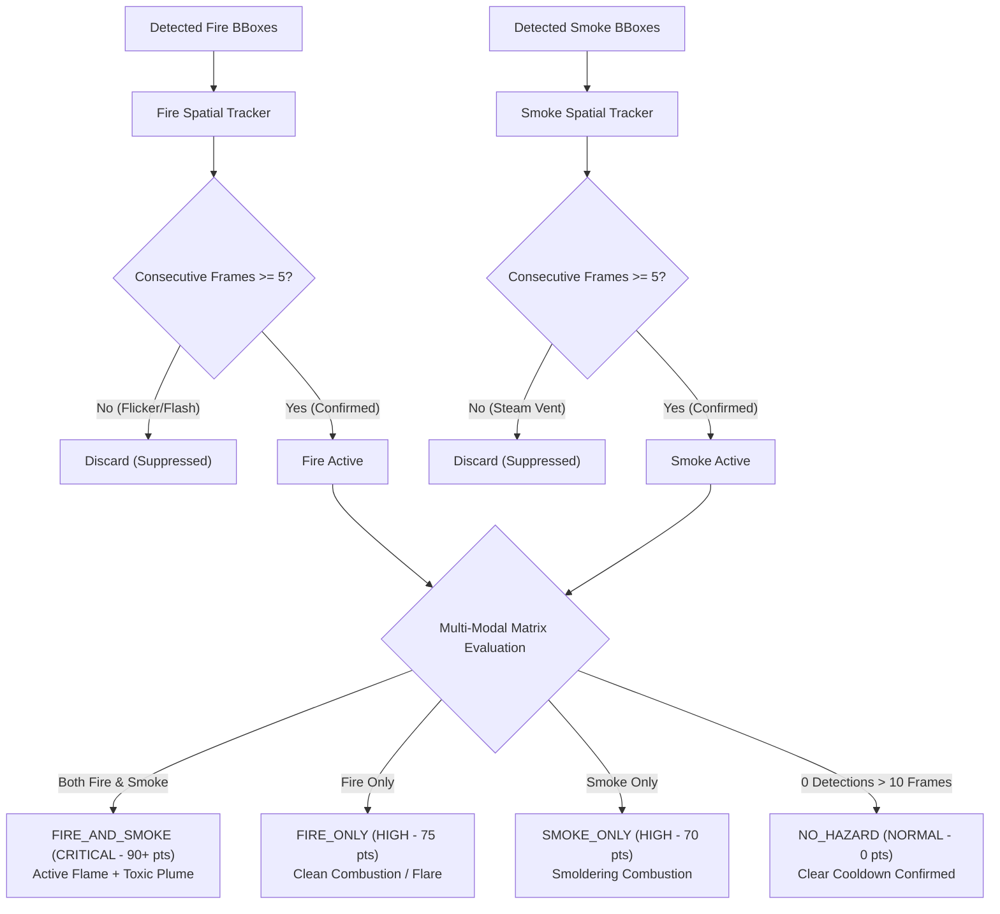

---

### Slide 8: Real-Time Security Operations Center (SOC) Dashboard

#### 1. Purpose & Strategic Focus
Demonstrates the user interface, operational workflows, live camera streams, real-time telemetry, and human-in-the-loop incident response mechanisms available to safety officers.

#### 2. Visual Layout & Composition
- **Header:** Category Pill `[OPERATIONS CENTER]`, Title: *Web-Based Real-Time Security Operations Center (SOC) Dashboard*
- **Layout:** 4 balanced operational capability cards ($420 \times 180$ pt and $420 \times 195$ pt) in a $2 \times 2$ grid.

#### 3. Detailed Content
1. **Multi-Camera Monitoring Grid (Top-Left):**
   - Responsive multi-camera tile grid supporting RTSP, USB, and file streams.
   - Live annotated snapshot stream delivering bounding boxes, track IDs, and compliance badges.
   - Live telemetry display: Rolling FPS, dropped frames, and inference latency in milliseconds.
2. **Worker Checklist HUD & Hazard Overlays (Bottom-Left):**
   - Compact visual checklist badges above tracked workers showing status for Helmet, Vest, Gloves, Footwear.
   - Color-coded badges: Green (`PRESENT`), Red (`ABSENT`), Gray (`UNKNOWN`).
   - Thermal/smoke indicators displaying active hazard relationships.
   - Zero fabricated data: every tile and metric binds to real database records.
3. **Bi-Directional WebSocket Streaming (Top-Right):**
   - Mounted at `/ws/alerts` for sub-100 ms event push.
   - In-memory `EventBroadcaster` pub/sub queue distributing events to connected clients.
   - Bi-directional heartbeat ping/pong protocol maintains socket liveness.
   - Automatic client disconnect cleanup and reconnection backoff.
4. **Operator Incident Action Triggers (Bottom-Right):**
   - Immediate human-in-the-loop controls directly on incident cards.
   - `Acknowledge`: Safety officer accepts incident, stopping visual flashing.
   - `Resolve`: Closes incident with mandatory resolution summary.
   - `Dismiss`: Records justified operational exception in immutable audit trail.
   - Role-Based Access Control: `VIEWER`, `OPERATOR`, and `ADMIN` operational tiers.

#### 4. Real-Time SOC Event Stream & Operator Sequence Diagram
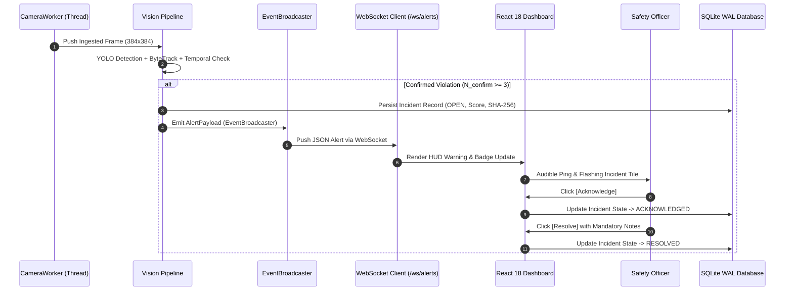

---

### Slide 9: Explainable Risk Scoring, Alerts & Evidence Archival

#### 1. Purpose & Strategic Focus
Covers the mathematical risk scoring formula, anti-flood alert deduplication rules, and tamper-evident visual evidence archival engine.

#### 2. Visual Layout & Composition
- **Header:** Category Pill `[GOVERNANCE & EVIDENCE]`, Title: *Explainable Risk Scoring, Smart Cooldowns & Tamper-Evident Evidence*
- **Left Column:**
  - Top Card ($420 \times 220$ pt): Deterministic 0–100 risk formula and factor weights.
  - Bottom Card ($420 \times 155$ pt): Alert deduplication, cooldowns, and escalation.
- **Right Column:**
  - Top Card ($420 \times 220$ pt): Tamper-evident SHA-256 evidence archival.
  - Bottom Card ($420 \times 155$ pt): External alert providers (Webhooks & Email).

#### 3. Detailed Technical Content
- **Explainable Risk Scoring Formula:**
  $$\text{Score} = \text{clamp}\left( \big(\text{BaseSeverity} + \text{Persistence} + \text{Density} + \text{Recurrence}\big) \times \text{ZoneMultiplier},\; 0,\; 100 \right)$$
  - Base Severity: Missing Helmet ($+30$), Vest ($+25$), Smoke ($+70$), Fire ($+90$)
  - Persistence Factor: $+0.5\text{ pts/sec}$ of sustained violation (capped at $+20$)
  - Worker Density: $+5\text{ pts per additional worker exposed}$
  - Zone Multiplier: Hazardous plant zones scaled from $1.1\times$ to $1.8\times$
  - Tiers: LOW (0–29) • MEDIUM (30–59) • HIGH (60–84) • CRITICAL (85–100)
- **Smart Alert Deduplication & Cooldowns:**
  - Aggregates repeat violations from the same worker into an ongoing `OPEN` incident record.
  - Enforces a 60-second cooldown window preventing alarm flooding during ongoing non-compliance.
  - Automatic escalation: violations unaddressed for $> 120$ seconds escalate in severity tier.
- **Tamper-Evident Visual Evidence:**
  - Annotated JPEG snapshot archived upon incident creation (`outputs/evidence/YYYY/MM/DD/{camera_id}/`).
  - Cryptographic SHA-256 checksum computed on write and permanently stored in database.
  - Verification API (`GET /api/evidence/{id}`) streams file and recomputes hash to detect unauthorized alterations.
  - Rolling 10 GB storage quota with automatic oldest-first pruning; path traversal defense blocks directory escapes.
- **External Alert Providers:**
  - Webhook Provider: JSON POST with HMAC-SHA256 signature in `X-SafeSync-Signature` header.
  - Email Provider: Plain text alerts via `smtplib` with STARTTLS encryption.
  - Zero fake claims: strictly reports `NOT_CONFIGURED` unless verified endpoints exist.

#### 4. Explainable Risk Engine & Evidence Vault Flowchart
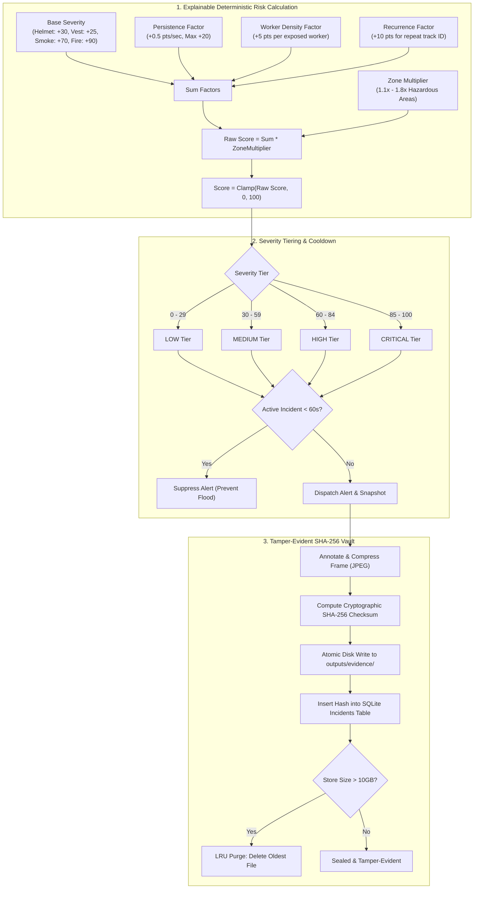

---

### Slide 10: Production-Grade Technology Stack

#### 1. Purpose & Strategic Focus
Outlines the complete software engineering stack, categorizing tools by architectural tier and demonstrating enterprise readiness.

#### 2. Visual Layout & Composition
- **Header:** Category Pill `[ENGINEERING STACK]`, Title: *Edge-Ready, Scalable Technology Stack*
- **Layout:** 4 clean vertical technology columns ($200 \times 390$ pt each) spanning the slide width.

#### 3. Detailed Stack Breakdown
1. **AI & Vision (Cyan):**
   - Python 3.13 runtime
   - Ultralytics YOLOv8n single-stage neural detector
   - PyTorch 2.14.0+cpu (CUDA hardware acceleration ready)
   - Custom ByteTrack multi-object tracker
   - 8-State Kalman Filter (`KalmanBoxTracker`) & Hungarian association
   - OpenCV (`cv2`) frame decoding & letterbox resizing
   - NumPy array operations
2. **Backend Services (Green):**
   - FastAPI asynchronous REST framework
   - Starlette & Uvicorn ASGI server
   - Pydantic v2 typed schema validation
   - Thread-isolated camera workers
   - Background `ThreadPoolExecutor` for non-blocking alert dispatch
   - In-memory `EventBroadcaster` pub/sub message bus
3. **Persistence & Security (Amber):**
   - SQLite relational database in Write-Ahead Logging (WAL) mode
   - `PRAGMA synchronous=NORMAL` & `PRAGMA foreign_keys=ON`
   - 5,000 ms busy timeout preventing write lock contention
   - SQLAlchemy ORM database models
   - Cryptographic PBKDF2-HMAC-SHA256 password hashing (600,000 iterations)
   - PyJWT token authentication (`HS256`)
   - SHA-256 cryptographic image hashing
4. **Frontend & Operations (Cyan):**
   - React 18 single-page application
   - TypeScript typed component architecture
   - Vite 6 production bundler
   - Tailwind CSS responsive styling
   - Native bi-directional WebSockets with heartbeat ping/pong
   - Prometheus `/metrics` exposition
   - Kubernetes `/health/live` and `/health/ready` probe endpoints
   - Rotating structured JSON logging

#### 4. Multi-Camera Edge Concurrency & Distributed Topology Architecture
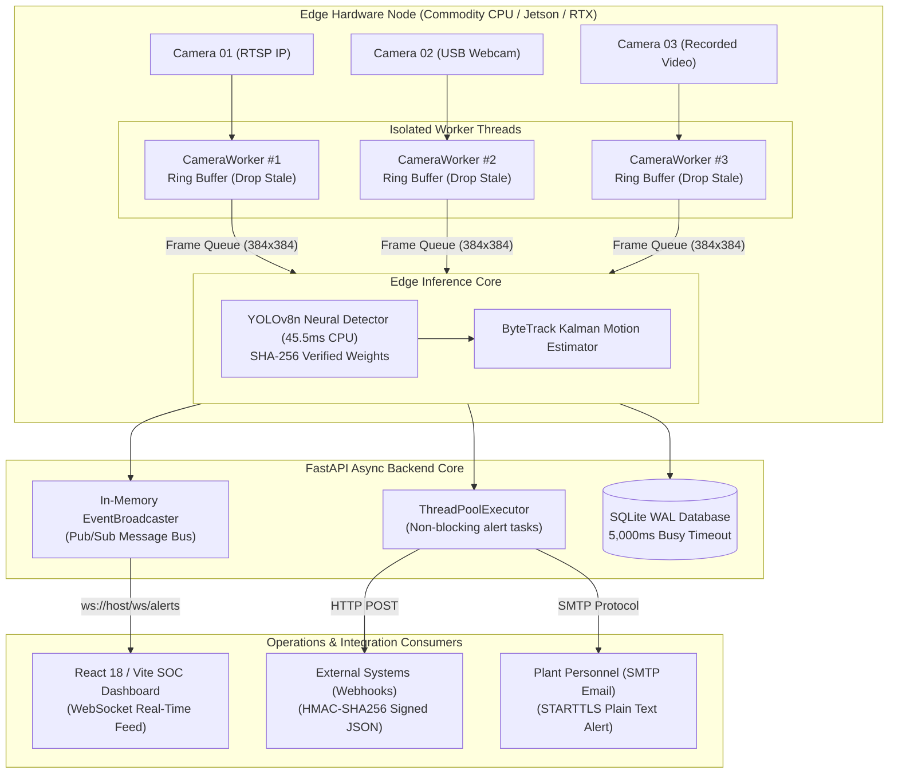

---

### Slide 11: Testing & Empirical Verification Scorecard

#### 1. Purpose & Strategic Focus
Provides an unvarnished, empirical verification scorecard presenting exact test results, latency benchmarks, memory stability measurements, and honest maturity classifications.

#### 2. Visual Layout & Composition
- **Header:** Category Pill `[VERIFICATION EVIDENCE]`, Title: *Rigorous Automated Testing & Hardware Verification Scorecard*
- **Top Section:** 4 large KPI metric tiles ($200 \times 110$ pt).
- **Bottom Section:** Dual comparison cards ($420 \times 265$ pt) cleanly segregating verified subsystems from items scheduled for industrial pilots.

#### 3. Detailed Verification Data
- **Numerical Metric Callouts:**
  - `160 / 160`: Backend Pytest Unit Tests Passing (**100% Pass Rate**)
  - `39 / 39`: End-to-End System Integration Scenarios Verified (**100% Pass Rate**)
  - `45.5 ms`: Mean CPU Pipeline Latency (~22–24 FPS on commodity 8-core CPU)
  - `0 Leaks`: Memory RSS Stability (+9.1 MB transient cache warm-up over 25 cycles)
- **Factual Verification Scorecard (Left Card):**
  - `[PASS]` AI Detection: 7 Canonical classes with verified SHA-256 weights
  - `[PASS]` Worker Tracking: ByteTrack 8-state Kalman trajectories
  - `[PASS]` PPE Compliance: Anatomical association & $N_{\text{confirm}} = 3$
  - `[PASS]` Occlusion Safety: `UNKNOWN` state strictly yields 0 false violations
  - `[PASS]` Hazard Engine: Dual-channel fire/smoke state machine ($N=5$)
  - `[PASS]` Risk & Alerts: Deterministic 0–100 score & 60s cooldown
  - `[PASS]` Evidence Store: SHA-256 checksummed snapshots & quota pruning
  - `[PASS]` Laptop Integrated Webcam: Real OpenCV live stream AI processing verified
- **Transparent Maturity Classification (Right Card):**
  - **Partially Verified:** RTSP IP camera streaming (validated via simulated network RTSP feeds; physical factory CCTV pilot pending).
  - **Implemented (Configuration Required):** External Webhooks with HMAC-SHA256 signatures and SMTP email notifications (fully coded; requires client endpoint URLs).
  - **Not Yet Validated (Roadmap):** Physical industrial CCTV hardware pilot in live factory environment; 24/72-hour continuous edge endurance soak test.

#### 4. Automated Testing & Verification Pipeline Flowchart
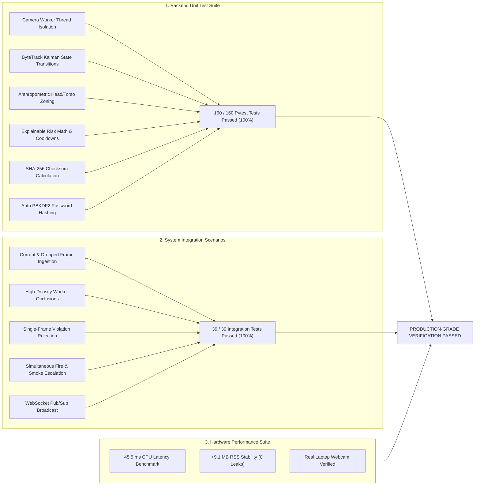

---

### Slide 12: Business Impact & Future Engineering Roadmap

#### 1. Purpose & Strategic Focus
Demonstrates operational value, ROI, and life-safety dividends for industrial enterprise adopters, while outlining concrete near-term and long-term engineering milestones.

#### 2. Visual Layout & Composition
- **Header:** Category Pill `[IMPACT & ROADMAP]`, Title: *Industrial Impact & Future Engineering Scope*
- **Layout:** Dual-column format ($420 \times 390$ pt each) contrasting operational impact against the engineering roadmap.

#### 3. Detailed Content
- **Immediate Operational & Economic Impact (Left Column):**
  1. *24/7 Automated Vigilance:* Replaces periodic walkthroughs and human observer fatigue with continuous computer vision surveillance across all facility zones.
  2. *Catastrophic Loss Prevention:* Sub-second flame and smoke confirmation detects early combustion before traditional ceiling smoke alarms or sprinklers engage.
  3. *Tamper-Evident Regulatory Compliance:* Cryptographically verified visual snapshot audit trail satisfies OSHA, STPI, and industrial safety compliance audits.
  4. *Frictionless Worker Experience:* Anonymous trajectory estimation avoids facial recognition privacy concerns while upholding life-safety standards.
- **Concrete Engineering Roadmap (Right Column):**
  - *Near-Term Priorities:*
    - Edge GPU Acceleration: TensorRT & ONNX Runtime INT8 quantization for 10+ simultaneous 4K streams on NVIDIA Jetson / RTX.
    - Extended Industrial Pilots: On-site pilot deployment with physical CCTV feeds at manufacturing plants.
    - 72-Hour Soak Testing: Extended memory stability and WAL checkpoint evaluation under continuous multi-camera load.
  - *Future Innovations:*
    - Industrial Protocol Interlocks: Modbus TCP, OPC-UA, and MQTT integrations for automated machinery emergency cutoffs.
    - Expanded Safety Gear: High-angle face shields, safety harnesses for work-at-height, and hearing protection.

#### 4. Phased Technology Evolution & Industrial Roadmap Flowchart


---

### Slide 13: Project Submission Summary & Conclusion

#### 1. Purpose & Strategic Focus
Provides a dignified closing slide summarizing project credentials, submission details, problem statement alignment, and the official GitHub repository.

#### 2. Visual Layout & Composition
- **Header Badge:** Pill container in dark navy with cyan text: `BPUT HACKATHON 2026 • PROBLEM STATEMENT PS06`
- **Vertical Accent:** Left vertical glowing emerald bar (`#10B981`)
- **Title Block:**
  - `SafeSync` in 44pt Bold White
  - `Detect • Understand • Alert • Protect` in 20pt Emerald Green
- **Central Showcase Container:** Large bordered card ($730 \times 220$ pt) presenting complete submission details.

#### 3. Content Breakdown
- **Team:** XERSES
- **Challenge:** PS06 — Build a prototype AI system that detects safety gear compliance
- **Organized By:** Software Technology Parks of India (STPI) & EmTek
- **Verified System Capabilities:**
  - 160 / 160 Unit Tests Passing
  - 39 / 39 Integration Scenarios Verified
  - ~24 FPS Real-Time CPU Inference
  - Zero-Biometric Anonymous Tracking
  - Anatomical PPE Association
  - Dual-Channel Fire/Smoke Detection
  - Explainable 0–100 Risk Engine
  - Tamper-Evident SHA-256 Evidence
  - React 18 Real-Time SOC Dashboard
- **Official GitHub Repository:** `https://github.com/SMRU08/SafeSync.git`

#### 4. Final Submission Architectural Invariant Diagram
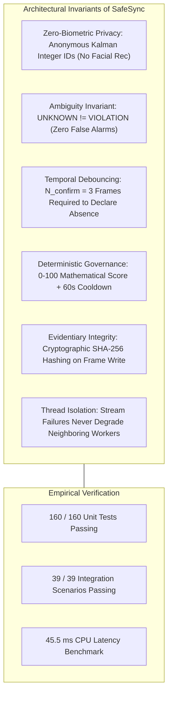

---

## Technical Data Reference Sheet

For quick reference during jury discussions, here are the verified system numbers:

| Parameter | Measured Value | Validation Reference |
|---|---|---|
| **Neural Architecture** | Ultralytics YOLOv8n (Nano) | `models/detection/ppe_fire_smoke_v2/` |
| **Active Checkpoint SHA-256** | `490a4867d0c9c848ed38e9d5b196a21f925371e3019079b6b7e30c0a5084b2f3` | `models/registry/model_registry.yaml` |
| **Canonical Classes** | 7 (`person`, `helmet`, `safety_vest`, `gloves`, `safety_footwear`, `fire`, `smoke`) | Standardized Safety Ontology |
| **Dataset Volume** | 22,453 normalized images / 51,195 bounding boxes | `datasets/processed/` |
| **Model Benchmark (mAP@50)** | **25.23%** (3.61× over V1 baseline) | `models/detection/ppe_fire_smoke_v2/` |
| **Mean End-to-End Latency** | **45.5 ms** (CPU-only execution) | `outputs/integration/performance_report.json` |
| **Effective Throughput** | ~22.0 to 24.1 FPS on 8-core CPU | Integration Benchmark |
| **Memory Delta (25 Cycles)** | +9.1 MB transient cache warm-up (0 leaks) | Process RSS Measurement |
| **Backend Unit Tests** | **160 / 160 Passed (100%)** | `backend/tests/` |
| **Integration Test Scenarios** | **39 / 39 Passed (100%)** | `scripts/testing/run_integration_tests.py` |
| **Frontend Production Build** | **Built in 3.44s (0 errors)** | `npm run build` (Vite 6 + React 18) |
| **Password Hashing** | PBKDF2-HMAC-SHA256 (600,000 iterations) | `backend/app/security/` |
| **Database Concurrency Mode** | SQLite Write-Ahead Logging (WAL) Mode | `backend/app/database/session.py` |
| **Evidence Checksum Algorithm** | Cryptographic SHA-256 | `backend/app/services/evidence_manager.py` |
| **Webcam Ingestion** | Integrated Laptop Webcam Index 0 Verified | `CameraWorker` (`backend/app/camera/worker.py`) |
| **Cascaded Person Recall** | Hybrid YOLOv8n Cascade Active | `backend/app/ai/detection/detector.py` |
| **Multi-Camera Deployment** | Dual Ingestion: Laptop Webcam (Cam 1) + Mobile Camera (Cam 2) | `configs/cameras.yaml` |

---

## Live Jury Demonstration Quick-Start Guide

Follow this streamlined script during your live technical evaluation before the BPUT Hackathon panel:

### 1. Boot the Full Stack in VS Code (Two Terminals)
```powershell
# Terminal 1 — Backend API & AI Surveillance Pipeline
cd backend
.\.venv\Scripts\Activate.ps1
uvicorn app.main:app --reload --host 0.0.0.0 --port 8000

# Terminal 2 — Real-Time Safety Operations Center (SOC) Dashboard
cd frontend
npm run dev
```

### 2. Evaluator Presentation Flow
1. **Executive SOC Overview:** Navigate to `http://localhost:5173` to demonstrate the live operations room with active cameras, real-time worker count, compliance percentage, and hazard indicators.
2. **Multi-Camera Surveillance Hub:**
   - Go to the **Cameras** tab: Show **Camera 01 (Laptop Webcam)** streaming live with DirectShow acceleration.
   - Show **Camera 02 (Mobile Phone Camera)** streaming over Wi-Fi (`http://<phone_ip>:8080/video`) via IP Webcam or USB DirectShow.
3. **Live Worker Tracking & Safety Violations:**
   - Sit or stand before the camera without a helmet or safety vest.
   - Switch to the **Workers** tab: Show **Worker #1** bounded and tracked across frames, displaying real-time checklist states:
     - `Hard Hat: CONFIRMED ABSENT` (Red badge)
     - `Safety Vest: CONFIRMED ABSENT` (Red badge)
     - `Overall Status: VIOLATION`
4. **Real-Time Incident & Alert Feed:**
   - Go to the **Alerts** tab: Point out the live alerts generated (`MISSING_HELMET`, `MISSING_SAFETY_VEST`) with severity ratings, affected track IDs, and camera zone mapping.
5. **Architectural Defense (`UNKNOWN != VIOLATION`):**
   - Emphasize to the jury that partially occluded or ambiguous limbs remain in the `UNKNOWN` state to prevent costly false alarms.
6. **Tamper-Evident Evidence Vault:**
   - Go to **Evidence**: Show incident visual frames hashed with SHA-256 upon generation, ensuring evidentiary integrity for regulatory reporting.
