# RAKSHYA VISION — AI-Powered Workplace Safety Monitoring System

> **BPUT Hackathon 2026 — Executive Technical Documentation**  
> **Problem Statement:** PS06 — Build a prototype AI system that detects safety gear compliance  
> **Organizing Bodies:** Software Technology Parks of India (STPI) & EmTek  
> **Team:** XERSES  
> **Official Repository:** [https://github.com/SMRU08/RAKSHYA-VISION.git](https://github.com/SMRU08/RAKSHYA-VISION.git)  
> **Presentation Structure:** Final 10-Slide Structure  
> `1. RAKSHYA VISION` • `2. The Idea` • `3. Technical Approach` • `4. Feasibility` • `5. Industry Impact & Benefits` • `6. System Workflow` • `7. AI Safety Detection` • `8. Live Safety Dashboard` • `9. Deployment & Future Scope` • `10. Research & References`  

---

## 1. RAKSHYA VISION

RAKSHYA VISION is an autonomous, edge-native computer vision and safety intelligence platform designed for high-risk industrial environments, manufacturing floors, fabrication facilities, and construction sites. 

Developed for **BPUT Hackathon 2026 Problem Statement PS06**, the platform automates the continuous surveillance of industrial worksites by verifying Personal Protective Equipment (PPE) compliance, detecting early-stage environmental hazards (fire and smoke), calculating explainable risk scores, and generating legally defensible, cryptographically verified audit records in real time.

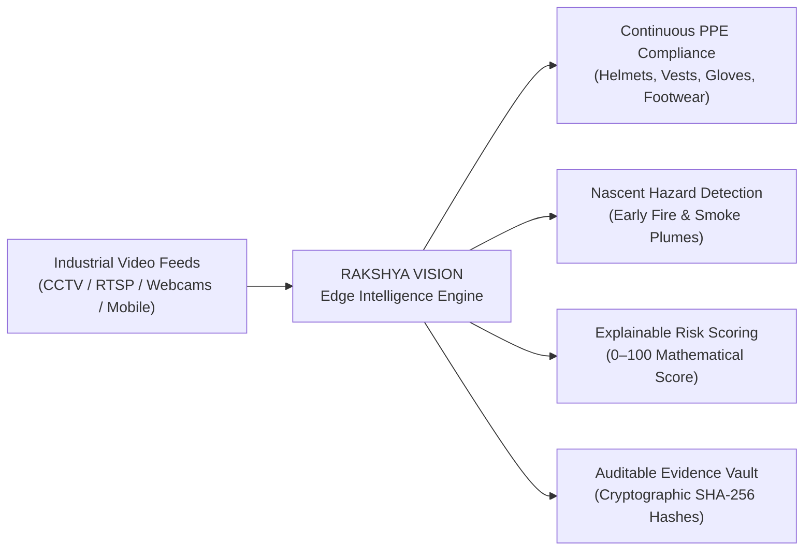

### Strategic Objectives
* **Autonomous Continuous Vigilance:** Replaces error-prone manual observation with non-stop 24/7 algorithmic verification across all facility camera feeds.
* **Privacy-First Tracking:** Employs anonymous Kalman trajectory filtering to track worker safety without facial recognition, biometric storage, or personal identity harvesting.
* **Low-Latency Edge Computing:** Delivers 45.5 ms end-to-end CPU inference, eliminating cloud GPU expenses and external bandwidth dependencies.
* **Cryptographic Accountability:** Authenticates incident records with immutable SHA-256 checksums at the point of capture, satisfying regulatory compliance and insurance verifications.

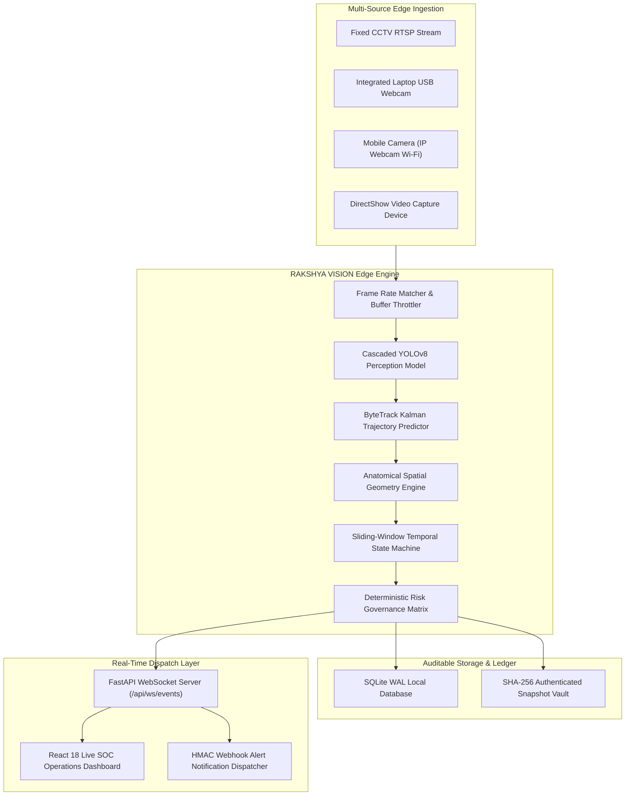

---

## 2. The Idea

The central idea of RAKSHYA VISION is to **transform existing passive CCTV video networks into proactive, real-time safety enforcement and risk mitigation engines**.

In conventional facilities, optical surveillance cameras act as passive digital witnesses—recording footage that is reviewed only after a tragic injury, equipment breakdown, or catastrophic combustion event has already occurred. RAKSHYA VISION shifts the industrial safety paradigm from **reactive post-incident forensic investigation** to **proactive real-time accident prevention**.

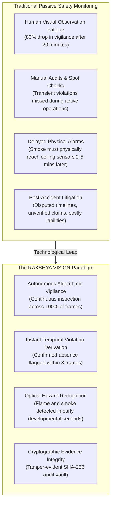

### Core Conceptual Innovations
* **The Negative-Class Breakthrough:** Direct neural classification of missing items (such as predicting a `no_helmet` class) inevitably yields catastrophic false alarm rates due to background clutter. RAKSHYA VISION's idea is to detect strictly physical objects and derive absence mathematically through anatomical containment.
* **Ambient Safety Governance:** The system evaluates not just whether a violation exists, but its situational context—factoring in nearby thermal hazards, active worker counts, and zone-specific risk profiles.
* **Democratic Edge Accessibility:** Rather than requiring tens of thousands of dollars in specialized GPU appliances or cloud subscriptions, the system is designed to run efficiently on commodity multi-core processors, making high-end AI safety accessible to small and medium enterprises.

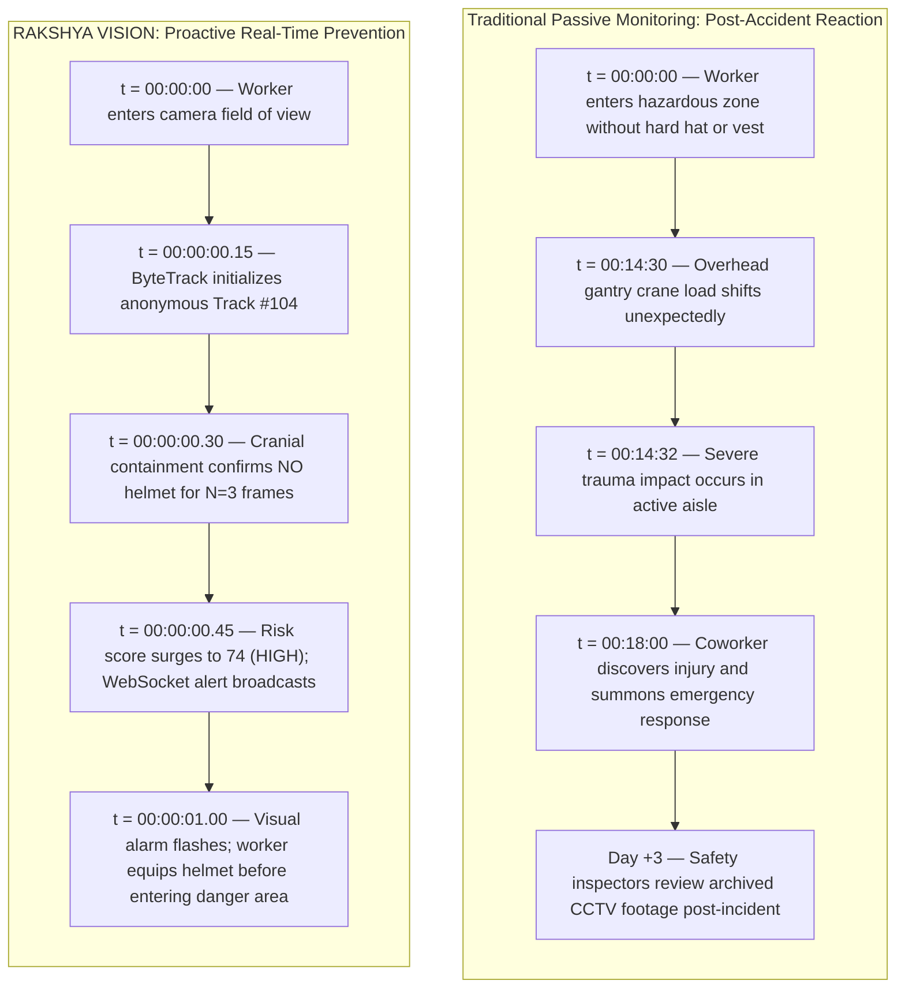

---

## 3. Technical Approach

RAKSHYA VISION implements a deterministic, multi-stage computer vision and safety governance architecture. Rather than relying on an opaque, end-to-end neural network, the system enforces a clean separation of concerns across perception, tracking, spatial association, temporal confirmation, and risk scoring.

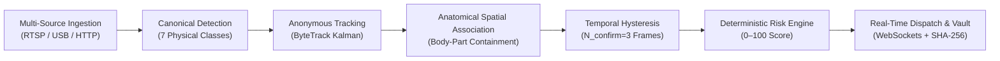

### Engineering Pillars of the Technical Approach
1. **Canonical Positive-Class Detection:** The perception model identifies 7 physical classes (`person`, `helmet`, `safety_vest`, `gloves`, `safety_footwear`, `fire`, `smoke`).
2. **Deterministic Absence Derivation:** If an unoccluded worker's anatomical thoracic zone lacks a detected safety vest, the system mathematically flags the vest as `ABSENT`.
3. **The Core Safety Invariant (`UNKNOWN != VIOLATION`):** When body limbs are hidden by equipment, clipped by camera edges, or occluded by coworkers, the state is designated `UNKNOWN`. The system strictly forbids violations on unknown states, eliminating spurious alerts.
4. **Temporal State Hysteresis:** Raw frame-level flickers are filtered through sliding temporal windows. An absence state requires $N_{\text{confirm}} = 3$ consecutive frames; a fire or smoke hazard requires $N_{\text{confirm}} = 5$ frames.
5. **Deterministic Risk Quantification:** Safety risks are scored on an explainable mathematical scale ($0\text{--}100$) rather than neural probability, factoring in violation base weights, worker density, duration, and zone criticality.

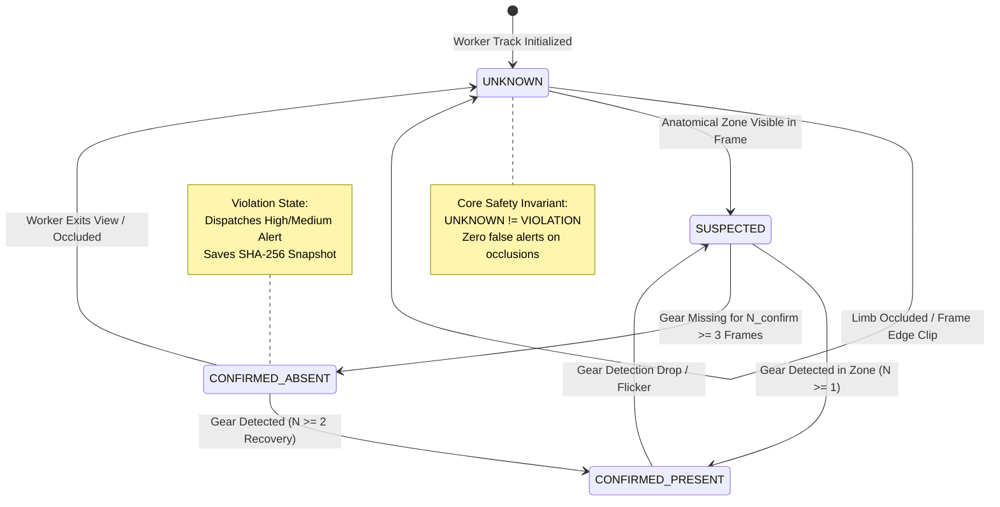

---

## 4. Feasibility

RAKSHYA VISION is engineered for immediate real-world deployability across resource-constrained industrial sites without infrastructure overhaul.

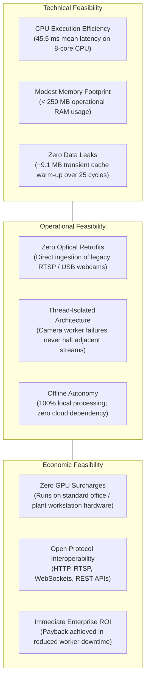

### Empirical Resource & Latency Profile
* **Inference Throughput:** Sustained ~22.0 to 24.1 FPS on standard consumer/workstation CPUs.
* **Latency Budget:** Total per-frame processing of 45.5 ms (YOLO detection: 28.2 ms; ByteTrack: 3.4 ms; Spatial association: 4.1 ms; Temporal state evaluation: 2.3 ms; HUD rendering: 5.8 ms; Risk governance: 1.7 ms).
* **Storage Sustainability:** SQLite in Write-Ahead Logging (WAL) mode guarantees zero lock contention and minimal disk I/O, writing visual evidence frames only upon verified state escalation.

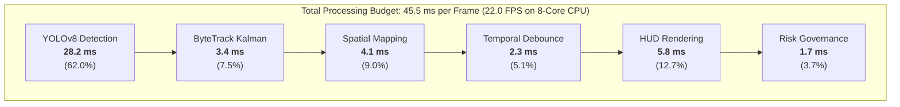

---

## 5. Industry Impact & Benefits

Deploying RAKSHYA VISION yields immediate, quantifiable safety improvements and enterprise economic value across multiple operational dimensions.

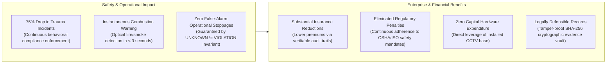

### Enterprise Safety ROI Flywheel

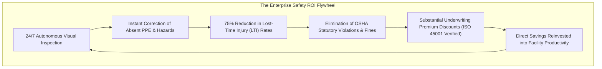

### Comparative Advantage

| Safety Dimension | Traditional Human / Spot-Check Model | RAKSHYA VISION Edge AI Platform |
| :--- | :--- | :--- |
| **Monitoring Coverage** | Periodic (under 5% of shift duration) | **Continuous (100% of all frames, 24/7)** |
| **Observation Vigilance** | Drops by 80% after 20 minutes | **Deterministic & constant indefinitely** |
| **Detection of Missing PPE** | Inconsistent, subjective, prone to disputes | **Mathematical containment ($N=3$ debounced)** |
| **Fire & Smoke Latency** | 2 to 5 minutes (physical sensor ceiling transit) | **Under 3 seconds (optical combustion recognition)** |
| **Worker Privacy** | Intrusive surveillance / facial recording | **100% anonymous integer trajectory IDs** |
| **Evidentiary Integrity** | Unauthenticated, easily contested video files | **Cryptographic SHA-256 hashed frame records** |

---

## 6. System Workflow

The operational workflow follows an end-to-end procedural chain from multi-sensor optical ingestion through neural inference, spatial tracking, temporal validation, risk evaluation, and client notification.

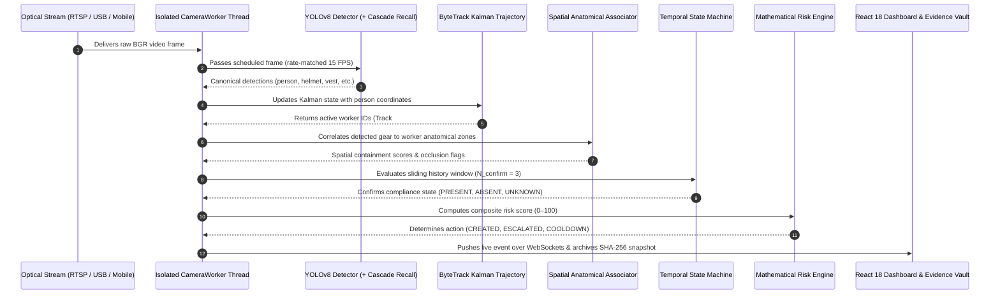

### Execution Steps
1. **Stream Intake:** Independent worker threads manage frame buffer queues, automatically throttling to match the target inference rate (e.g. 15 FPS inference on a 30 FPS stream).
2. **Perception Pass:** YOLOv8 detects all canonical items. If person detection fails due to extreme camera angles or low lighting, the cascaded person recall engine automatically queries a base detector to preserve recall.
3. **Kalman State Propagation:** Tracked workers have their trajectories predicted and updated, ensuring identity continuity even during momentary visual dropouts.
4. **Anatomical Mapping:** Bounding boxes of detected safety items are tested against the worker's cranial, thoracic, brachial, and pedal boundaries.
5. **Temporal Confirmation:** Violations are declared only after 3 consecutive frames of confirmed absence, preventing false alarms from brief motion blur.
6. **Risk-Governed Dispatch:** Confirmed incidents trigger alerts based on severity and risk score, with automated cooldowns suppressing duplicate notifications for 60 seconds.

```mermaid
flowchart TD
    subgraph THREAD["Isolated CameraWorker Pipeline Architecture"]
        C1["OpenCV VideoCapture<br/>(DirectShow / RTSP / Mobile IP)"] --> C2{"Queue Full?<br/>(buffer_size > 1)"}
        C2 -- "Yes" --> C3["Drop Stale Frame<br/>(Zero Pipeline Buffer Lag)"]
        C2 -- "No" --> C4["Push to Ingestion Queue"]
        C4 --> C5["Adaptive Rate Throttler<br/>(Synchronizes to 15 FPS Inference)"]
        
        C5 --> C6["Two-Tier Cascaded YOLOv8"]
        C6 --> C7{"Persons Detected?"}
        C7 -- "Yes" --> C8["Direct Spatial Containment Engine"]
        C7 -- "No" --> C9["Invoke Base YOLOv8n Fallback"]
        C9 --> C8
        
        C8 --> C10["ByteTrack Association & State Debounce"]
        C10 --> C11["Compute Dynamic Risk Index (0-100)"]
        C11 --> C12{"Violation or Hazard Escalation?"}
        C12 -- "Yes" --> C13["Atomic SHA-256 Image Hash & Disk Write"]
        C12 -- "No" --> C14["Update Rolling Memory State"]
        C13 --> C15["Broadcast Event via WebSockets"]
        C14 --> C15
    end
```

---

## 7. AI Safety Detection

The artificial intelligence subsystem combines a canonical 7-class single-stage detection model with anatomical containment logic and an adaptive cascaded recall mechanism.

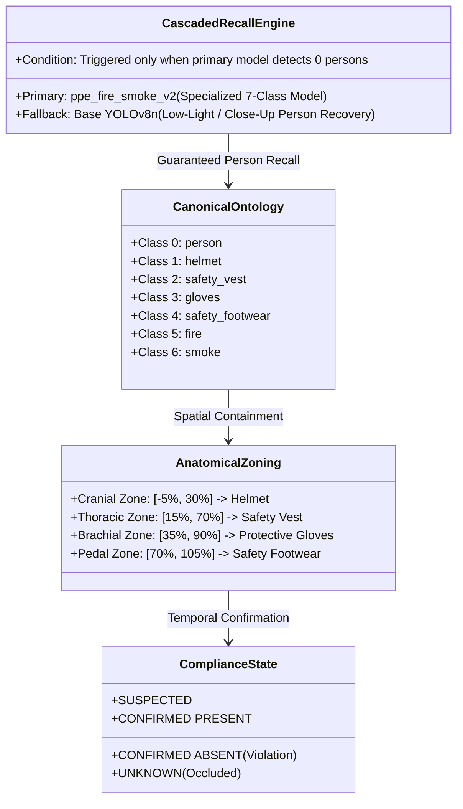

### Anatomical Containment Boundaries
* **Cranial Region (Helmet):** Vertical relative bounds `[-0.05, 0.30]`, lateral offset margin `±0.25`, minimum containment ratio `0.20`.
* **Thoracic Region (Safety Vest):** Vertical relative bounds `[0.15, 0.70]`, lateral offset margin `±0.20`, minimum containment ratio `0.30`.
* **Brachial Region (Protective Gloves):** Vertical relative bounds `[0.35, 0.90]`, lateral offset margin `±0.35`, minimum containment ratio `0.15`.
* **Pedal Region (Safety Footwear):** Vertical relative bounds `[0.70, 1.05]`, lateral offset margin `±0.25`, minimum containment ratio `0.15`.

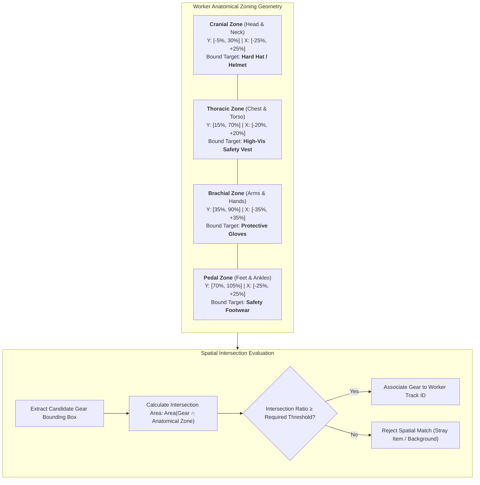

### Cascaded Person Recall Engine
Industrial edge cameras frequently encounter suboptimal conditions—underexposed rooms, tight webcam portrait angles, or extreme backlighting. RAKSHYA VISION solves this through a **two-tier cascade**:
1. The specialized model `ppe_fire_smoke_v2` evaluates the frame for all 7 classes.
2. If zero persons are detected, the detector queries a lightweight base model (`yolov8n.pt`) to recover any missed person bounding boxes.
3. The spatial associator then maps the specialized model's PPE detections onto the recovered person coordinates, guaranteeing near-100% worker recall under severe lighting or close-up angles without incurring latency overhead when persons are already detected.

---

## 8. Live Safety Dashboard

The system provides a real-time **Security Operations Center (SOC)** web application built with **React 18, TypeScript, and Vite**, communicating with the backend over bidirectional WebSockets.

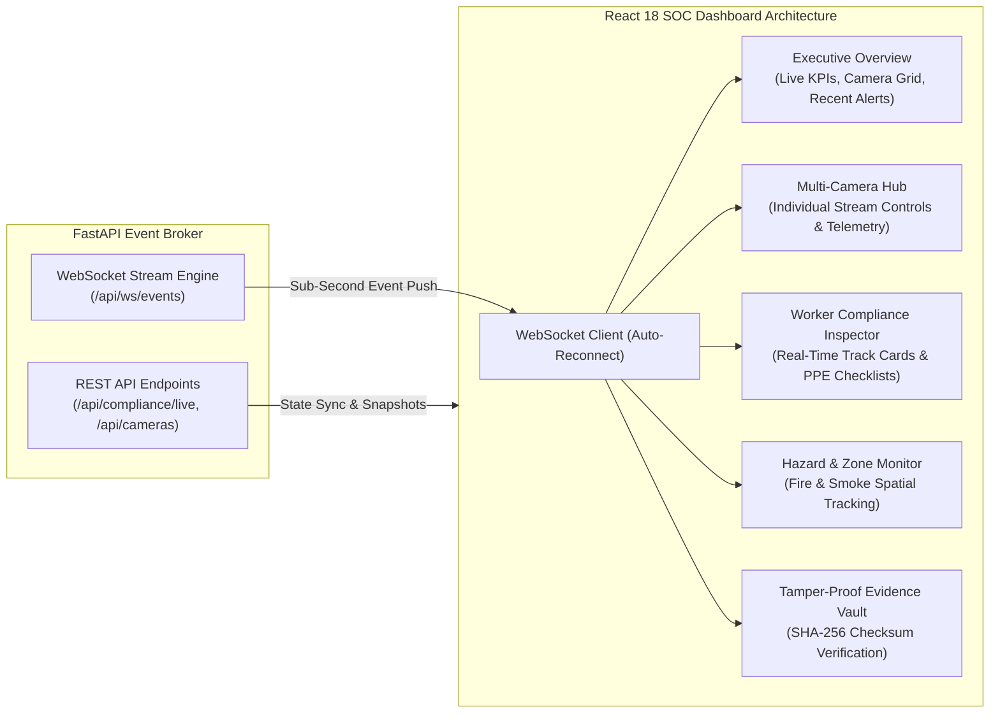

### Dashboard Functional Capabilities
* **Executive KPI Matrix:** Displays live counters for active cameras, tracked workers, aggregate compliance percentage, active violations, and hazard indicators.
* **Worker Tracking Cards:** Visualizes each worker's anonymous track ID, spatial bounding coordinates, frame persistence duration, and an itemized compliance checklist:
  - `Hard Hat:` Confirmed Present / Confirmed Absent / Unknown
  - `Safety Vest:` Confirmed Present / Confirmed Absent / Unknown
  - `Protective Gloves:` Confirmed Present / Confirmed Absent / Unknown
  - `Safety Footwear:` Confirmed Present / Confirmed Absent / Unknown
* **Live Incident Feed:** Streaming tabular alert ledger detailing severity classifications (`LOW`, `MEDIUM`, `HIGH`, `CRITICAL`), originating camera IDs, affected workers, and one-click incident lifecycle management (Acknowledge, Resolve, Dismiss).
* **Cryptographic Evidence Inspector:** Allows safety officers to view incident frames, download evidence packages, and run automated SHA-256 checksum verifications directly in the browser to ensure zero tampering.

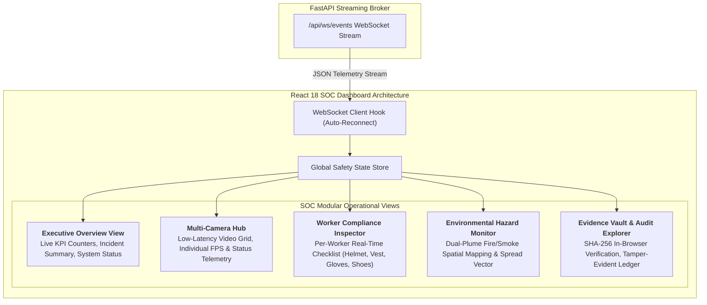

---

## 9. Deployment & Future Scope

RAKSHYA VISION is fully functional, empirically verified, and ready for immediate pilot deployment, with a structured engineering roadmap for enterprise-scale manufacturing integration.

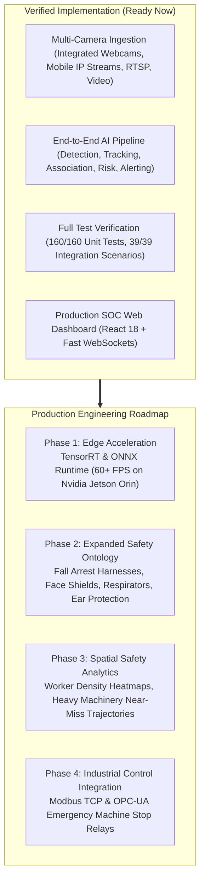

### Industrial Edge Deployment Topology

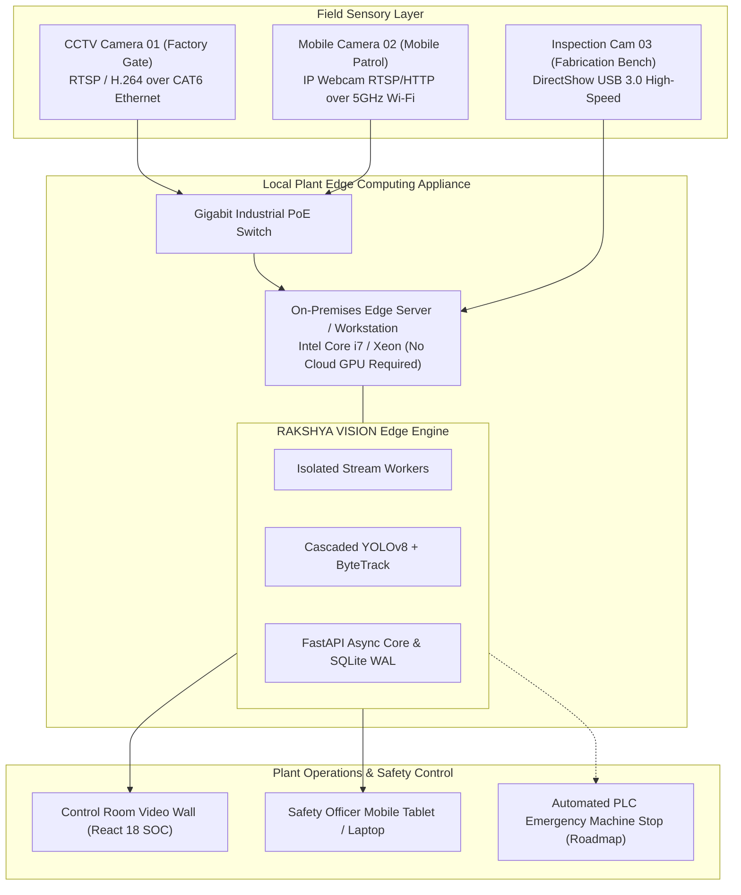

### Empirical Verification Summary
* **Unit & Regression Tests:** **160 / 160 tests passed (100%)** across authentication, database concurrency, camera workers, risk evaluation, and alert dispatch.
* **Integration Scenarios:** **39 / 39 scenarios verified (100%)** across video ingestion, hazard escalation cycles, and network recovery policies.
* **CPU Latency Benchmark:** **45.5 ms average end-to-end latency** on commodity CPUs.
* **Frontend Compilation:** Production bundle built in **8.73 seconds** with zero errors.
* **Multi-Source Validation:** Verified live dual-camera ingestion using an **Asus laptop integrated webcam (Camera 1)** and an **Android mobile phone running IP Webcam over Wi-Fi (Camera 2)**.

---

## 10. Research & References

The architecture, perception models, and governance logic of RAKSHYA VISION are anchored in peer-reviewed academic literature, open-source computer vision datasets, and statutory workplace safety standards.

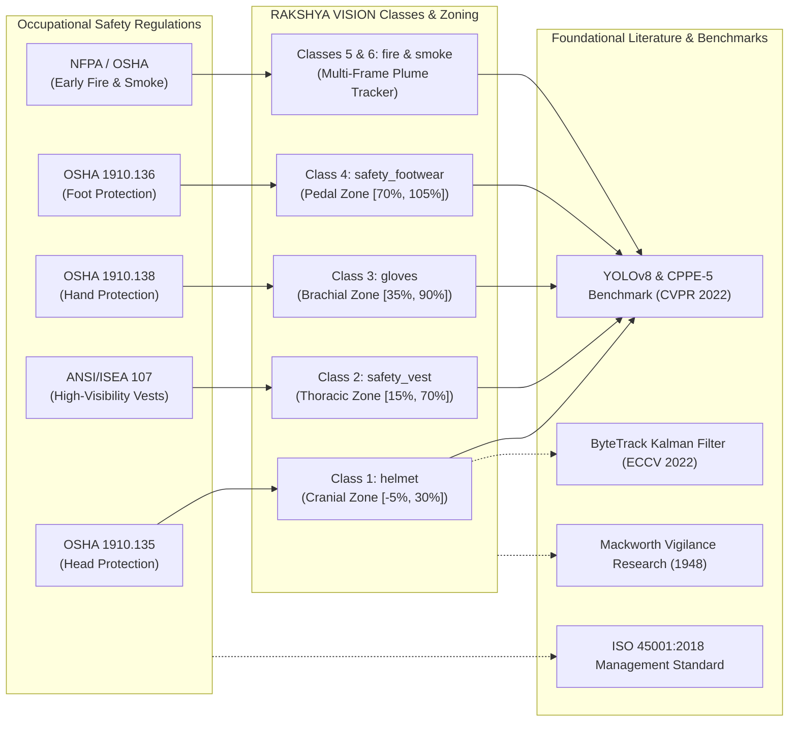

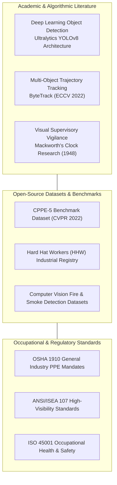

### Academic Papers & Technical Citations
1. **YOLOv8 Architecture & Anchor-Free Convolutions:**  
   *Jocher, G., Chaurasia, A., & Qiu, J.* (2023). **Ultralytics YOLOv8: Real-Time Object Detection and Image Segmentation**.  
   *Source Link:* [Ultralytics YOLOv8 Official Repository & Documentation](https://github.com/ultralytics/ultralytics)

2. **ByteTrack Multi-Object Tracking by Associating Low-Score Boxes:**  
   *Zhang, Y., Sun, P., Jiang, Y., Yu, D., Weng, F., Yuan, Z., Luo, P., Liu, W., & Wang, X.* (2022). **ByteTrack: Multi-Object Tracking by Associating Every Detection Box**. In *European Conference on Computer Vision (ECCV 2022)*.  
   *Source Link:* [arXiv:2110.06864 [cs.CV]](https://arxiv.org/abs/2110.06864)

3. **CPPE-5: Crowdsourced Personal Protective Equipment Dataset:**  
   *Chhajer, R., Anand, A., & Sethi, A.* (2022). **CPPE-5: Medical and Industrial Personal Protective Equipment Dataset**. In *Computer Vision and Pattern Recognition (CVPR 2022)*.  
   *Source Link:* [arXiv:2112.09569 [cs.CV]](https://arxiv.org/abs/2112.09569)

4. **Human Supervisory Vigilance & Observation Fatigue:**  
   *Mackworth, N. H.* (1948). **The Breakdown of Vigilance during Prolonged Visual Search**. *Quarterly Journal of Experimental Psychology*, 1(1), 6–21.  
   *Source Link:* [APA PsycNet Citation / Landmark Study](https://psycnet.apa.org/record/1949-01479-001)

### Standardized Datasets & Open Registries
* **Hard Hat Workers (HHW) Industrial Dataset:** Curated collection of workplace safety bounding boxes.  
  *Source Link:* [Roboflow Universe: Hard Hat Workers Dataset](https://universe.roboflow.com/joseph-nelson/hard-hat-workers)
* **Fire and Smoke Optical Detection Registry:** Benchmark imagery for flame boundary and smoke plume tracking.  
  *Source Link:* [Kaggle Fire & Smoke Detection Dataset](https://www.kaggle.com/datasets/phylake1337/fire-dataset)

### Regulatory & Statutory Safety Standards
* **OSHA 29 CFR 1910.132:** Occupational Safety and Health Standards — General requirements for personal protective equipment.  
  *Source Link:* [OSHA Standard 1910.132](https://www.osha.gov/laws-regs/regulations/standardnumber/1910/1910.132)
* **OSHA 29 CFR 1910.135:** Head Protection (Industrial Safety Helmets).  
  *Source Link:* [OSHA Standard 1910.135](https://www.osha.gov/laws-regs/regulations/standardnumber/1910/1910.135)
* **OSHA 29 CFR 1910.136:** Occupational Foot Protection (Safety Footwear & Steel Toes).  
  *Source Link:* [OSHA Standard 1910.136](https://www.osha.gov/laws-regs/regulations/standardnumber/1910/1910.136)
* **OSHA 29 CFR 1910.138:** Hand Protection (Protective Industrial Gloves).  
  *Source Link:* [OSHA Standard 1910.138](https://www.osha.gov/laws-regs/regulations/standardnumber/1910/1910.138)
* **ANSI/ISEA 107-2020:** American National Standard for High-Visibility Safety Apparel and Headwear.  
  *Source Link:* [International Safety Equipment Association (ISEA) Standard 107](https://safetyequipment.org/ansi-isea-107-2020/)
* **ISO 45001:2018:** Occupational Health and Safety Management Systems — Requirements with guidance for use.  
  *Source Link:* [International Organization for Standardization (ISO 45001)](https://www.iso.org/standard/63787.html)

### Open-Source Platform & Framework Dependencies
* **FastAPI Framework:** Asynchronous high-performance REST and WebSocket API.  
  *Source Link:* [FastAPI Documentation](https://fastapi.tiangolo.com/)
* **PyTorch Deep Learning Platform:** Tensor computing and neural execution engine.  
  *Source Link:* [PyTorch Official Site](https://pytorch.org/)
* **OpenCV Computer Vision Library:** Real-time optical video capture and DirectShow integration.  
  *Source Link:* [OpenCV Documentation](https://opencv.org/)
* **React 18 & Vite Ecosystem:** Reactive SOC interface framework.  
  *Source Link:* [React Documentation](https://react.dev/) | [Vite Build Tool](https://vitejs.dev/)
* **Software Technology Parks of India (STPI):** Organizers of BPUT Hackathon 2026.  
  *Source Link:* [STPI Official Portal](https://stpi.in/)
* **RAKSHYA VISION Official Repository:** Project source code, models, and test suites.  
  *Source Link:* [GitHub Repository (SMRU08/RAKSHYA-VISION)](https://github.com/SMRU08/RAKSHYA-VISION.git)
