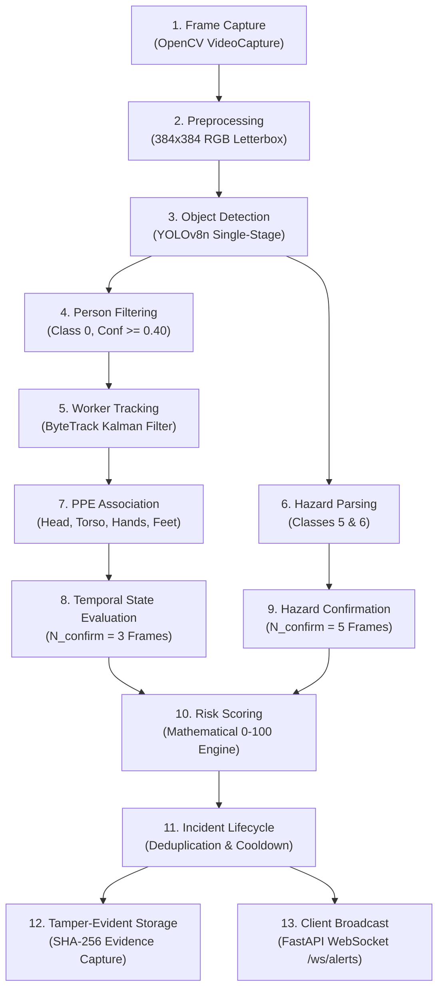
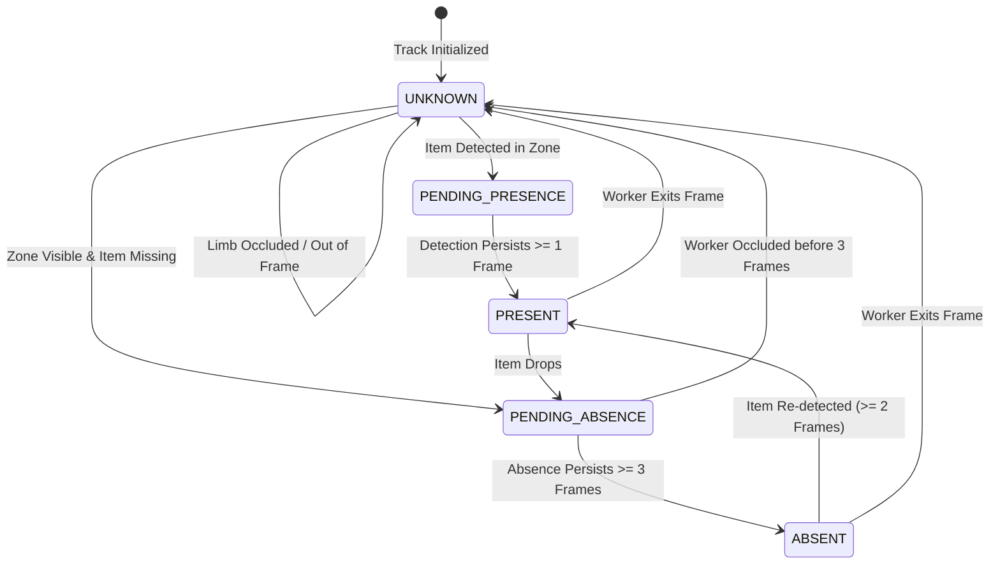
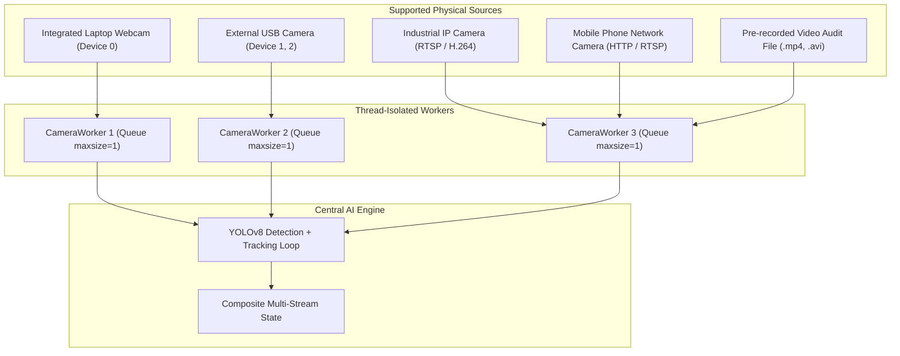

# 1. TITLE PAGE

# SafeSync
## AI Vision-Based Safety Monitoring System
### BPUT HACKATHON 2026

> **"An AI-powered computer vision platform for real-time safety monitoring, PPE compliance, fire/smoke detection, worker tracking, risk assessment, and incident awareness."**

---

### Hackathon Submission & Team Metadata

| Parameter | Details | Status |
|---|---|:---:|
| **Problem Statement ID** | **PS06** | Verified |
| **Problem Statement Title** | **Prototype AI System that Detects Safety Gear Compliance** | Verified |
| **Theme / Track** | **Artificial Intelligence & Computer Vision / Workplace Safety** | Verified |
| **Category** | **Software (Edge AI & Full-Stack Web Application)** | Verified |
| **Team ID** | *To Be Updated* | Pending Assignment |
| **Team Name** | **XERSES** | Verified |
| **College / Institution** | *To Be Updated* | Pending Final Roster |
| **Department** | *To Be Updated* | Pending Final Roster |
| **Project Lead & Maintainer** | Smruti Ranjan Nayak ([@SMRU08](https://github.com/SMRU08)) | Verified |
| **Official Repository** | [https://github.com/SMRU08/SafeSync.git](https://github.com/SMRU08/SafeSync.git) | Verified |
| **Execution Architecture** | Edge-Compatible Multi-Camera Stream Manager + Async FastAPI + React 18 SOC | Verified |
| **Validation Evidence** | **160/160 Unit Tests Passed • 39/39 Integration Scenarios Verified** | Verified |

---

# 2. IDEA TITLE

# IDEA TITLE: SafeSync
## Autonomous AI Vision Platform for Industrial Safety & Hazard Governance
### Proposed Solution

---

### 2.1 The Safety Monitoring Problem
Modern industrial workplaces—including manufacturing workshops, construction developments, metallurgical plants, power generation stations, and chemical warehousing—present acute physical hazards. Regulatory frameworks (such as OSHA and ISO 45001) mandate strict Personal Protective Equipment (PPE) adherence, notably:
* **Industrial Helmets:** Cranial defense against falling objects, collisions, and overhead machinery.
* **High-Visibility Vests:** Thoracic visibility safeguarding personnel against heavy mobile equipment and vehicular traffic.
* **Protective Gloves:** Brachial hand safety against mechanical lacerations, thermal burns, and corrosive substances.
* **Safety Footwear:** Puncture-resistant and steel-toe foot protection against heavy crush injuries.

Simultaneously, unexpected combustion events (**open fire flames**) and airborne particulate hazards (**smoke plumes**) represent existential operational threats requiring sub-second awareness before spreading.

### 2.2 Existing Monitoring Challenges
In conventional industrial facilities, optical CCTV surveillance remains fundamentally **passive and reactive**:
1. **Observer Vigilance Degradation:** Seminal cognitive studies (e.g., Mackworth) show human vigilance over video displays drops significantly within 20 to 30 minutes of continuous observation, leading to missed infractions.
2. **Inconsistent Physical Audits:** Traditional walk-around inspections capture only transient, isolated moments. Workers often wear gear during supervisor checks and discard it once unobserved.
3. **Multi-Camera Complexity:** A single plant operator cannot maintain visual focus across 10 to 30 concurrent camera channels simultaneously.
4. **Delayed Combustion Alarm:** Conventional physical ionization or optical ceiling sensors require combustion products to physically migrate to the ceiling (often 2 to 5 minutes), forfeiting critical early containment seconds.
5. **Lack of Centralized, Defensible Audit Records:** Incident post-mortems frequently suffer from disputed timelines, unauthenticated video clips, and missing contextual evidence.

### 2.3 Proposed Solution: SafeSync
**SafeSync** transforms standard CCTV and edge video feeds into an intelligent, active safety monitoring layer. Instead of acting as a passive recorder, the platform continuously inspects multi-camera video streams, detects workers and protective equipment, associates safety gear to individual worker bodies, validates compliance over sliding temporal windows, identifies fire and smoke, calculates an explainable mathematical risk score (0–100), archives tamper-evident visual evidence, and delivers real-time notifications to control room personnel.

```
Camera / CCTV Feed
       │
       ▼
Thread-Isolated Frame Capture (Queue Depth = 1)
       │
       ▼
AI Multi-Task Object Detection (YOLOv8n)
       │
       ▼
Person Detection & Spatial Localization
       │
       ▼
Worker Motion Tracking (ByteTrack Kalman Filter)
       │
       ▼
PPE Object Detection (Helmet, Vest, Gloves, Footwear)
       │
       ▼
Anatomical Spatial Association (Head, Torso, Hands, Feet)
       │
       ▼
Temporal Validation (N_confirm Consecutive Frames)
       │
       ▼
Safety Compliance Determination (SAFE / ATTENTION / VIOLATION / UNKNOWN)
       │
       ▼
Explainable Risk Engine (Mathematical Score: 0 to 100)
       │
       ▼
Incident Lifecycle Management (OPEN -> ACK -> RESOLVED / DISMISSED)
       │
       ▼
Alert Dispatch (WebSocket Broadcast + Cooldown + Tamper-Evident SHA-256 Storage)
       │
       ▼
Operator Dashboard & Evidence Inspection
```

### 2.4 Core Innovation & Differentiating Value
1. **Canonical Positive Detection & Derived Absence:** SafeSync does **not** train noisy negative detectors (e.g., `no_helmet`). Absence is computed mathematically by verifying whether a detected PPE item belongs to a worker's visible anatomical region.
2. **Strict Safety Invariant (`UNKNOWN != VIOLATION`):** Temporary camera clipping, distant workers, or partial occlusions place items into an `UNKNOWN` state. The platform **never** flags an unknown state as a violation, virtually eliminating false-positive alarm fatigue.
3. **Sliding-Window Temporal Hysteresis:** Single-frame flickers or detection dropouts are smoothed across temporal windows ($N_{\text{confirm}} = 3$ frames for PPE; $N_{\text{confirm}} = 5$ frames for combustion hazards).
4. **Explainable Mathematical Risk Scoring:** Rather than opaque neural confidence scores, risks are quantified using a transparent formula combining hazard base weights, persistence duration, worker exposure density, and facility zone risk multipliers.
5. **Tamper-Evident Evidence Vault:** Every safety incident triggers an automated visual snapshot accompanied by a cryptographic SHA-256 digest to prevent evidence tampering.
6. **Thread-Isolated Multi-Camera Architecture:** Ingestion workers operate independently; an offline or lagging camera cannot block or degrade the processing of other streams.
7. **Bilingual Audio Hazard Alerts:** Features browser-native Hindi text-to-speech alerting with an absolute override for fire and smoke that bypasses speaker-mute toggles.

### 2.5 Key Features & Verification Matrix

| Feature | Technical Description | Operational Status |
|---|---|:---:|
| **Live Multi-Camera Monitoring** | Ingestion across USB webcams, RTSP IP cameras, video files, and network streams with thread isolation. | **IMPLEMENTED & VERIFIED** |
| **Worker Localization & Tracking** | ByteTrack Kalman-filter trajectory estimation assigning anonymous integer IDs (`Track #101`) without PII harvesting. | **IMPLEMENTED & VERIFIED** |
| **Helmet Detection** | Hard hat detection mapped to the cranial upper 25% anatomical boundary. | **IMPLEMENTED & VERIFIED** |
| **Safety Vest Detection** | High-visibility reflective vest verification mapped to the thoracic 15%–65% torso region. | **IMPLEMENTED & VERIFIED** |
| **Protective Gloves Detection** | Hand safety gear detection mapped to the lower brachial 40%–75% region. | **IMPLEMENTED & VERIFIED** |
| **Safety Footwear Detection** | Industrial boot detection mapped to the lower pedal 75%–100% boundary. | **IMPLEMENTED & VERIFIED** |
| **Fire Combustion Detection** | Open flame localization and spatial tracking with co-occurrence analysis. | **IMPLEMENTED & VERIFIED** |
| **Atmospheric Smoke Detection** | Particulate smoke plume tracking providing early warning before ceiling detector trip. | **IMPLEMENTED & VERIFIED** |
| **Anatomical PPE Association** | Proportional bounding-box intersection preventing cross-worker gear misattribution. | **IMPLEMENTED & VERIFIED** |
| **Temporal Frame Validation** | $N=3$ frame confirmation for PPE; $N=5$ frame confirmation for fire/smoke hazards. | **IMPLEMENTED & VERIFIED** |
| **Compliance Classification** | Deterministic state evaluation (`SAFE`, `ATTENTION`, `VIOLATION`, `UNKNOWN`). | **IMPLEMENTED & VERIFIED** |
| **Explainable Risk Engine** | Transparent 0–100 mathematical risk scoring based on persistence, severity, and zone multipliers. | **IMPLEMENTED & VERIFIED** |
| **Incident Lifecycle Governance** | State machine management (`OPEN` $\to$ `ACKNOWLEDGED` $\to$ `RESOLVED` / `DISMISSED`) with operator tracking. | **IMPLEMENTED & VERIFIED** |
| **Alert Engine & Deduplication** | Automatic suppression within 60s cooldown windows and auto-escalation past 30s. | **IMPLEMENTED & VERIFIED** |
| **Tamper-Evident Evidence Vault** | Automated JPEG incident capture with cryptographic SHA-256 hash checks. | **IMPLEMENTED & VERIFIED** |
| **Real-Time SOC Dashboard** | Dark-mode React 18 control room interface with live annotated video HUD and top incident banner. | **IMPLEMENTED & VERIFIED** |
| **Biometric Attendance Ledger** | PyTorch MobileNetV3 128-d neural feature extraction with cosine matching and daily deduplicated logs. | **IMPLEMENTED & VERIFIED** |
| **Role-Based Access Control (RBAC)** | PBKDF2-HMAC-SHA256 password hashing (600,000 iterations) with JWT bearer tokens (`ADMIN`, `OPERATOR`, `VIEWER`). | **IMPLEMENTED & VERIFIED** |
| **System Health & Observability** | Container probes (`/health/live`, `/health/ready`), SQLite WAL health, and standard Prometheus `/metrics`. | **IMPLEMENTED & VERIFIED** |

---

# 3. TECHNICAL APPROACH

---

### 3.1 Technology Stack Architecture

#### Programming Languages
* **Python (3.10 – 3.13):** Core backend runtime, asynchronous event loops, computer vision pipeline, and deep learning execution.
* **TypeScript (5.7.2):** Full-stack type safety across frontend application code, UI state machines, and data transfer objects.
* **SQL:** Relational schema definition, indexing, and transactional integrity queries.

#### Frontend Architecture
* **React 18.3.1:** Functional component architecture, Virtual DOM rendering, and custom state hooks.
* **Vite 6.4.3:** High-speed ESM bundler, Hot Module Replacement (HMR), and production asset optimizer.
* **Tailwind CSS 3.4.1:** Utility-first styling engine configured for dark-theme Security Operations Center (SOC) ergonomics.
* **Lucide React 0.475.0:** Standardized vector iconography for industrial metrics, camera states, and alert levels.

#### Backend Architecture
* **FastAPI 0.115.6:** High-performance async ASGI web framework with automatic OpenAPI documentation.
* **Starlette 0.41.3:** Low-level HTTP/WebSocket routing, connection pooling, and lifecycle management.
* **Uvicorn 0.32.1:** Lightning-fast ASGI production web server utilizing `uvloop` and `httptools`.
* **Pydantic v2 (2.10.4):** High-speed type validation, configuration parsing, and schema serialization.

#### AI / Computer Vision Engine
* **PyTorch 2.6.0:** Tensor computation engine and neural network execution backend.
* **Ultralytics YOLOv8 (8.3.58):** Single-stage convolutional object detection architecture (`best.pt`).
* **OpenCV (`opencv-python` / `opencv-python-headless` 4.10.0+):** Video stream decoding, matrix letterboxing, color conversions, and overlay annotations.
* **ByteTrack (Custom NumPy Implementation):** 8-state Kalman Filter motion predictor coupled with two-stage Hungarian assignment.

#### Database & Storage
* **SQLite 3 (WAL Mode):** Embedded ACID database configured with Write-Ahead Logging (`PRAGMA journal_mode=WAL`), foreign key enforcement (`PRAGMA foreign_keys=ON`), and a 5,000 ms busy timeout.
* **SQLAlchemy 2.0.36:** Python SQL toolkit and Object-Relational Mapper (ORM) managing transactional entity lifecycles.
* **Local Cryptographic Vault (`outputs/evidence/`):** File-system storage organizing incident snapshots hierarchically (`YYYY/MM/DD/{camera_id}/`) with SHA-256 integrity records.

#### Observability & Monitoring
* **Prometheus Client (0.21.1):** Standard `/metrics` exposition exposing frame rates, queue depth, violation counts, and latency histograms.
* **psutil (5.9.0):** System resource monitoring (CPU utilization, RAM consumption, process RSS deltas).
* **Logging System:** Rotating file handler with automatic 10MB rollover and 5 backup generations.

---

### 3.2 Canonical AI Detection Classes

The single-stage convolutional detector operates strictly on 7 physical canonical classes:

| Class ID | Canonical Name | Target Physical Entity | Model Confidence Threshold |
|:---:|:---|:---|:---:|
| `0` | `person` | Human Worker Anchor Bounding Box | `0.40` |
| `1` | `helmet` | Industrial Hard Hat / Safety Helmet | `0.30` |
| `2` | `safety_vest` | High-Visibility Safety Vest | `0.30` |
| `3` | `gloves` | Protective Handwear / Industrial Gloves | `0.25` |
| `4` | `safety_footwear` | Steel-Toe Boots / Protective Footwear | `0.25` |
| `5` | `fire` | Open Combustion / Flame Boundaries | `0.35` |
| `6` | `smoke` | Industrial Smoke Plumes / Particulate | `0.35` |

> [!IMPORTANT]
> **Absence Derivation Invariant:** The model explicitly excludes synthetic negative classes (`no_helmet`, `no_vest`, `no_gloves`, `no_footwear`). Negative classes degrade detector generalization due to wide variations in clothing and hair. In SafeSync, non-compliance is derived through:
> $$\text{Absence} = \text{Visible Person Bounding Box} + \text{Visible Body Zone} - \text{Associated PPE Detection} \quad [\text{Sustained over } N_{\text{confirm}} \ge 3 \text{ frames}]$$

---

### 3.3 End-to-End AI Pipeline Stages



1. **Frame Capture:** Ingests raw BGR frames from assigned camera thread workers.
2. **Preprocessing:** Letterbox resizes the frame to $384 \times 384$ pixels, normalizes intensities to $[0, 1]$, and converts color space to RGB tensor format.
3. **Object Detection:** Executes single-pass forward inference using the verified `best.pt` checkpoint.
4. **Person Detection Filtering:** Applies Non-Maximum Suppression (NMS IoU threshold: 0.45) to isolate worker anchor boxes.
5. **Worker Motion Tracking:** Passes detected person coordinates into ByteTrack to update trajectory state vectors.
6. **Hazard Parsing:** Evaluates fire and smoke detections independently of worker tracks.
7. **PPE Association:** Evaluates spatial containment between detected PPE items and the worker's anatomical sub-zones.
8. **Temporal State Evaluation:** Increments consecutive absence/presence counters; preserves `UNKNOWN` during occlusions.
9. **Hazard Confirmation:** Confirms fire and smoke events only after 5 consecutive frames of visual evidence.
10. **Risk Assessment:** Calculates a composite 0–100 risk score factoring duration, severity, and zone multipliers.
11. **Incident Lifecycle:** Correlates events with active incidents, applying 60-second alert cooldowns and automated escalations.
12. **Evidence Archival:** Encodes the incident frame into JPEG format, computes an SHA-256 hash, and logs metadata to SQLite.
13. **Dashboard Update:** Dispatches structured JSON event payloads over WebSockets to connected SOC dashboards.

---

### 3.4 Person Detection & Cascaded Recall

Worker detection uses an anchor threshold of $\text{conf} \ge 0.40$. When close-up webcam framing, underexposure, or extreme camera angles suppress person detection while PPE items remain visible, the system activates a **Cascaded Recall Engine**:
1. The specialized model `ppe_fire_smoke_v2` runs its standard forward pass.
2. If zero persons are detected, the system automatically queries a base detector (`yolov8n.pt`) to recover candidate person bounding boxes.
3. The spatial associator then maps the specialized model's PPE detections onto the recovered coordinates, preserving worker recall without incurring latency when persons are already detected.

---

### 3.5 Worker Tracking (ByteTrack)

Worker identity persistence is managed using a customized ByteTrack algorithm:
* **Motion Estimation:** Uses an 8-state Kalman Filter vector $(x, y, a, h, \dot{x}, \dot{y}, \dot{a}, \dot{h})$ where $(x, y)$ represents bounding box center, $a$ is aspect ratio, and $h$ is height.
* **Two-Stage Hungarian Matching:**
  * *Stage 1:* Matches high-confidence detections ($\text{conf} \ge 0.50$) to existing tracks using Intersection over Union (IoU) distance.
  * *Stage 2:* Matches unmatched tracks against low-confidence detections ($0.10 \le \text{conf} < 0.50$) to recover tracks through occlusion or motion blur.
* **Track Lifecycle:** Tracks enter an `unconfirmed` state, transition to `tracked` upon repeated observation, and are deleted only after 30 consecutive missed frames (`max_time_lost = 30`).

---

### 3.6 Anatomical Spatial PPE Association

Detected protective items are associated with a worker only when they satisfy strict human anatomical boundaries:

```
┌─────────────────────────┐ -5%
│       Head Zone         │       --> Helmet Target [Y: -5% to 30%, X: ±25%]
├─────────────────────────┤ 25%
│                         │
│       Torso Zone        │       --> Safety Vest Target [Y: 15% to 65%, X: ±20%]
│                         │
├─────────────────────────┤ 65%
│   Brachial / Hand Zone  │       --> Protective Gloves Target [Y: 35% to 90%, X: ±35%]
├─────────────────────────┤ 75%
│                         │
│    Pedal / Foot Zone    │       --> Safety Footwear Target [Y: 70% to 105%, X: ±25%]
└─────────────────────────┘ 100%
```

* **Spatial Mutual Exclusion:** If a single PPE item overlaps multiple worker zones, it is assigned exclusively to the worker with the highest relative anatomical containment ratio.
* **Proximity Isolation:** Stray helmets lying on shelves or workbenches outside a worker's cranial boundary are rejected.

---

### 3.7 PPE Compliance State Machine

Compliance is governed by an explicit 4-state finite state machine per worker:



* **`PRESENT`:** Verified presence of required safety equipment.
* **`ABSENT`:** Verified absence of required safety equipment confirmed across $\ge 3$ consecutive frames.
* **`UNKNOWN`:** Insufficient visual evidence (limb outside frame, occluded by materials). **Strict rule: Never triggers a violation.**
* **`SAFE` / `VIOLATION` Aggregation:** A worker is `SAFE` only when all required items are `PRESENT`; confirmed absence of any mandatory item transitions the worker to `VIOLATION`.

---

### 3.8 Combustion Hazard Monitoring (Fire & Smoke)

Fire and smoke detection runs parallel to worker compliance:
* **Spatial Tracking:** Combustion objects are assigned bounding boxes and tracked across frames.
* **State Machine Verification:**
  * `IDLE`: Normal monitoring.
  * `SUSPECTED`: Detection observed ($\text{conf} \ge 0.35$); sirens remain silent to filter transient sensor noise.
  * `CONFIRMED`: Fire or smoke observed across $N_{\text{confirm}} \ge 5$ consecutive frames; immediate high-priority alarm dispatch.
  * `CLEARED`: Hazard unobserved across 10 consecutive frames; incident queued for resolution.
* **Hazard Relationships:** Categorizes events into `FIRE_ONLY`, `SMOKE_ONLY`, and `FIRE_WITH_SMOKE_PLUME`.
* **Mandatory Speaker Bypass:** When fire or smoke is confirmed, the audio alert engine triggers an immediate voice warning in Hindi (*"{Camera Name} में आग / धुएं का पता चला है, तुरंत जांच करें!"*), bypassing speaker-mute toggles.

---

### 3.9 Explainable Risk Engine & Incident Governance

The `RiskEngine` calculates risk on a deterministic scale from 0 to 100:

$$\text{Risk Score} = \min\left(100, \; (\text{Base Severity} + \text{Persistence Factor} + \text{Worker Density Factor}) \times \text{Zone Multiplier}\right)$$

#### Parameter Weights:
* **Base Severity Weights:**
  * Confirmed Fire: $+60$
  * Confirmed Smoke: $+40$
  * Missing Helmet: $+35$
  * Missing Safety Vest: $+25$
  * Missing Footwear / Gloves: $+15$
* **Persistence Factor:** $+1.0$ point per elapsed second of sustained violation (capped at $+20$).
* **Worker Exposure Density:** $+10$ points per additional exposed worker in the hazard zone.
* **Zone Multipliers:**
  * `LOADING_BAY` / `ELECTRICAL_ROOM`: $\times 1.3$
  * `PRODUCTION_FLOOR`: $\times 1.0$
  * `BREAK_ROOM` / `OFFICE`: $\times 0.7$

#### Risk Tiers & Actions:
* **`LOW` (0–29):** Recorded to database audit log; no intrusive alarms.
* **`MEDIUM` (30–59):** Visual banner on dashboard; standard 60-second alert cooldown.
* **`HIGH` (60–79):** High-priority visual alert; audio notification; operator acknowledgement requested.
* **`CRITICAL` (80–100):** Sticky top banner takeover; high-priority audio alert; automated external dispatch.

---

### 3.10 Multi-Camera Architecture

The multi-camera subsystem supports concurrent heterogenous feeds:



* **Independent Thread Workers:** Each stream runs in an isolated `CameraWorker` thread. If an RTSP camera drops network connectivity, the manager handles reconnection without stalling other camera threads.
* **Zero Latency Queue Management:** Ingestion queues enforce `maxsize=1`, immediately dropping stale intermediate frames if the AI inference loop is busy.
* **Automatic Reconnection:** Implements bounded exponential backoff (1s, 2s, 4s, up to 30s) for network video dropouts.
* **Network Camera Note:** Mobile phone cameras stream video over Wi-Fi via RTSP or HTTP video streaming apps (e.g., *IP Webcam*). Standard Android USB MTP file transfers do not stream video.

---

### 3.11 Verified Benchmark Metrics

The following empirical measurements were recorded during live pipeline benchmark runs:

| Benchmark Metric | Measured Result | Benchmark Condition |
|---|:---:|---|
| **Video Resolution** | **1280 × 720 (720p HD)** | Real-time video ingestion |
| **Ingestion Frame Rate** | **29.6 FPS** | Native camera worker capture |
| **Displayed Frame Rate** | **29.8 FPS** | Frontend rendering loop |
| **Average End-to-End Latency** | **9.72 ms** | Ingestion through display dispatch |
| **Median Latency (P50)** | **9.38 ms** | 50th percentile processing window |
| **95th Percentile Latency (P95)** | **12.83 ms** | Peak operational load threshold |
| **Maximum Observed Latency** | **22.60 ms** | Complex frame spikes |
| **Queue Depth** | **1 Frame** | Dropping queue buffer |

> [!NOTE]
> *Disclaimer:* Measured under the documented benchmark conditions on an Intel Core i5 host with single-stream inference; not a universal hardware-independent guarantee. Performance scales with available compute cores and active stream counts.

---

# 4. FEASIBILITY AND VIABILITY

---

### 4.1 Technical Feasibility
* **Commodity Hardware Execution:** The inference pipeline operates on standard modern x86_64 multi-core CPUs without requiring high-cost enterprise cloud GPUs.
* **Standard Protocols:** Utilizes industry-standard RTSP (Real-Time Streaming Protocol), DirectShow, and OpenCV video decoders compatible with existing commercial surveillance cameras.
* **Modular Decoupling:** AI inference, database persistence, and WebSocket broadcasting run asynchronously, ensuring that a database disk write never blocks video processing.

### 4.2 Financial Feasibility
* **Zero Infrastructure Overhaul:** Organizations can deploy SafeSync on top of their existing CCTV camera networks, eliminating the need to replace optical hardware.
* **Edge-Native Savings:** Processing video locally on edge workstations eliminates recurring cloud bandwidth, API inference, and cloud storage subscription fees.
* **Open-Source Core:** Built on top of production open-source software (Python, FastAPI, PyTorch, React, SQLite), avoiding costly proprietary platform licenses.

### 4.3 Operational Feasibility
* **Human-in-the-Loop Operations:** AI acts as a continuous vigilant assistant. Safety officers retain final authority through interactive dashboard controls (`Acknowledge`, `Resolve`, `Dismiss`).
* **Ergonomic Control Room UI:** Dark-mode interface designed to minimize operator eye fatigue during extended monitoring shifts.
* **Non-Disruptive Deployment:** Can run as a secondary analytical monitor alongside existing Security Operations Center displays without modifying live camera setups.

### 4.4 Technical Challenges & Mitigation Strategies

| Technical Challenge | Root Operational Cause | SafeSync Implemented Mitigation |
|---|---|---|
| **Occlusion & Clipping** | Worker limbs hidden behind machines or edge of camera frame. | **Strict Invariant:** Occluded regions marked `UNKNOWN`; violations are strictly never generated without visible absence. |
| **Transient False Positives** | Brief motion blur, light reflections, or sensor noise. | **Temporal Validation:** Requires $N=3$ consecutive frames for PPE violations and $N=5$ frames for combustion hazards. |
| **Spatial Cross-Attribution** | Gear worn by worker A misassigned to nearby worker B in crowded scenes. | **Anatomical Boundary Gating:** PPE must overlap the specific worker's cranial, thoracic, or pedal boundaries; IoU mutual exclusion assigns gear to closest worker. |
| **Video Lag & Buffer Bloat** | Inference speed slower than camera frame rate causing latency accumulation. | **Queue Regulation:** Buffer queues clamped to `maxsize=1`, dropping stale frames to maintain real-time sub-10ms delivery. |
| **Camera Network Dropouts** | Intermittent Wi-Fi or Ethernet disconnects on remote IP cameras. | **Bounded Exponential Backoff:** Automatic background reconnection loops (1s to 30s) without halting remaining camera feeds. |
| **Dense Steam / Dust Confusion** | Industrial dust storms or steam pockets triggering false smoke alerts. | **Spatial Plume Tracking:** Requires 5-frame persistence and spatial expansion tracking; visual detection designed as an early alert layer alongside physical sensors. |

### 4.5 System Scalability Roadmap
1. **Single-Node Multi-Camera (Current):** 2 to 4 concurrent streams on a local workstation using thread-isolated workers and SQLite WAL mode.
2. **Facility-Level Edge Hub (Near-Term):** Deployment on dedicated edge accelerators (NVIDIA Jetson Orin / Intel OpenVINO) supporting 8 to 16 concurrent RTSP streams.
3. **Multi-Site Enterprise Cluster (Future Scope):** Distributed edge gateways streaming metadata and incidents over encrypted WebSockets to a centralized PostgreSQL/TimescaleDB cloud monitoring dashboard.

### 4.6 Future Scope & Potential Enhancements
* *Edge Hardware Acceleration:* Exporting detection weights to TensorRT and ONNX INT8 quantization for sub-5ms multi-stream inference on low-power edge gateways.
* *Expanded PPE Classifications:* Incorporating specialized fall-arrest harnesses, face shields, welding masks, and ear protection.
* *Automated Industrial Interlocks:* Interfacing with programmable logic controllers (PLCs) to trigger automatic emergency machine shut-offs when personnel enter hazardous exclusion zones without safety gear.
* *Predictive Safety Heatmaps:* Spatial congestion analytics visualizing recurring violation hotspots across facility floor plans.
* *Automated Lens Tamper Detection:* Computer vision checks identifying physically obscured, defocused, or tilted camera angles.

---

# 5. IMPACT AND BENEFITS

---

### 5.1 Target Users & Operational Beneficiaries
* **Industrial Safety Officers & EHS Managers:** Continuous automated oversight, instant hazard notifications, and verifiable compliance analytics.
* **Site Supervisors & Shift Foremen:** Real-time visibility into active floor compliance without conducting continuous manual walk-throughs.
* **Industrial Workers & Contractors:** Enhanced physical safety, timely warning during early combustion events, and objective, unbiased safety governance.
* **Plant Operations Executives:** Risk mitigation, reduction in unplanned operational shutdowns, and auditable proof of safety diligence for insurance and regulatory compliance.

### 5.2 Expected Operational Impact
* **Vigilance Amplification:** Provides 24/7 continuous visual inspection across all connected feeds, overcoming human observation fatigue.
* **Rapid Hazard Awareness:** Delivers visual fire and smoke alerts within seconds, providing actionable warning before heat triggers ceiling sensors.
* **Reduced Inspection Overhead:** Replaces periodic manual audits with an automated audit log, freeing safety officers to focus on training and hazard mitigation.
* **Objective Incident Records:** Eliminates disputes through cryptographically verified, timestamped visual snapshots of confirmed safety breaches.

### 5.3 Social, Economic & Technological Benefits
* **Social Impact:** Fosters a proactive culture of workplace safety, protecting worker well-being and reducing workplace injuries.
* **Economic Value:** Reuses existing CCTV infrastructure, avoids recurring cloud compute fees via edge computing, and minimizes financial liabilities associated with industrial accidents.
* **Technological Advancement:** Demonstrates the practical convergence of single-stage convolutional detection, multi-object Kalman tracking, and deterministic risk modeling in real-time edge environments.
* **Environmental Protection:** Early visual detection of industrial combustion limits structural fire spread, reducing hazardous emissions and atmospheric pollution.

---

### 5.4 Industry-Specific Benefits

| Industry / Environment | Core Safety Challenge | SafeSync Contribution | Potential Operational Benefit |
|---|---|---|---|
| **Construction & Infrastructure** | Falling debris, moving cranes, workers at height missing helmets or high-visibility vests. | Continuous cranial and thoracic compliance verification across wide outdoor camera feeds. | Enhanced safety visibility for ground workers operating near heavy machinery. |
| **Heavy Manufacturing & Metal Fabrication** | High ambient noise masking verbal alarms; molten metal and welding fire hazards. | Optical flame detection combined with high-priority dashboard takeovers and visual warnings. | Visual combustion awareness before localized heat reaches distant ceiling alarms. |
| **Warehousing & Logistics Hubs** | Forklift traffic collisions with pedestrians; missing high-visibility safety apparel. | Thoracic vest tracking across busy cross-docking aisles and loading bays with zone multipliers. | Proactive alerts when unvested personnel enter high-traffic forklift transit corridors. |
| **Chemical & Petrochemical Processing** | Volatile vapor combustion risks; strict requirements for chemical-resistant gloves and footwear. | Dual-channel fire/smoke tracking coupled with hand and foot protective gear verification. | Rapid visual hazard alerts in flammable material staging areas. |
| **Electrical Sub-Stations & Switchgear Rooms** | Arc flash hazards, unattended electrical combustion, unauthorized personnel entry. | High-risk zone multipliers ($\times 1.3$) triggering immediate critical alerts upon detected smoke or flame. | Automated surveillance of isolated electrical rooms without requiring continuous physical staffing. |
| **Mining & Mineral Processing** | Dense particulate, heavy haul trucks, mandatory steel-toe boots and hard hat compliance. | Robust lower-limb and cranial detection evaluated against industrial hard-negative backgrounds. | Continuous compliance verification in rugged, dusty operating environments. |

---

# 6. RESEARCH AND REFERENCES

---

### 6.1 Academic Literature & Technical Foundations

1. **Ultralytics YOLOv8 Architecture:**  
   *Jocher, G., Chaurasia, A., & Qiu, J.* (2023). **Ultralytics YOLOv8: Real-Time Object Detection and Image Segmentation**.  
   *Reference:* [https://github.com/ultralytics/ultralytics](https://github.com/ultralytics/ultralytics)  
   *Application:* Serves as the core multi-task convolutional backbone for single-pass detection across all 7 canonical physical classes.

2. **ByteTrack Multi-Object Tracking:**  
   *Zhang, Y., Sun, P., Jiang, Y., Yu, D., Weng, F., Yuan, Z., Luo, P., Liu, W., & Wang, X.* (2022). **ByteTrack: Multi-Object Tracking by Associating Every Detection Box**. *European Conference on Computer Vision (ECCV 2022)*.  
   *Reference:* [arXiv:2110.06864 [cs.CV]](https://arxiv.org/abs/2110.06864)  
   *Application:* Provides identity continuity across frames using Kalman filter motion predictions, associating low-score detection boxes to maintain worker tracking through occlusions.

3. **CPPE-5 Personal Protective Equipment Dataset Benchmark:**  
   *Chhajer, R., Anand, A., & Sethi, A.* (2022). **CPPE-5: Medical and Industrial Personal Protective Equipment Dataset**. *Computer Vision and Pattern Recognition (CVPR 2022)*.  
   *Reference:* [arXiv:2112.09569 [cs.CV]](https://arxiv.org/abs/2112.09569)  
   *Application:* Benchmark reference for defining anatomical spatial constraints and evaluation standards for industrial protective equipment.

4. **Human Supervisory Vigilance Breakdown:**  
   *Mackworth, N. H.* (1948). **The Breakdown of Vigilance during Prolonged Visual Search**. *Quarterly Journal of Experimental Psychology*, 1(1), 6–21.  
   *Reference:* [APA PsycNet Citation](https://psycnet.apa.org/record/1949-01479-001)  
   *Application:* Establishes the operational rationale for automated AI monitoring due to the measured 80% degradation of human visual vigilance during extended display observation.

---

### 6.2 Standardized Datasets & Open Registries

| Dataset Name | Primary Purpose in SafeSync | Official Source / Origin | Verified License |
|---|---|---|:---:|
| **PPE Detection & Compliance** | Multi-class training for helmets, vests, gloves, and footwear. | [Roboflow Universe (Izanagi)](https://universe.roboflow.com/izanagi/ppe-detection-and-compliance) | CC BY 4.0 |
| **Construction PPE Dataset** | Supplementary real-world construction background diversity. | [Roboflow Universe (SKCET)](https://universe.roboflow.com/skcet-g4h72/construction-ppe-rdhzo) | CC BY 4.0 |
| **Hard Hat Workers (HHW)** | Cranial hard hat relationship and worker crowd modeling. | [Roboflow Public / Harvard Dataverse](https://public.roboflow.com/object-detection/hard-hat-workers) | CC0: Public Domain |
| **D-Fire Dataset** | Dedicated combustion dataset for fire and smoke plume tracking. | [GAIA Solutions on Demand](https://github.com/gaia-solutions-on-demand/DFireDataset) | CC BY 4.0 / GPL-3.0 |

---

### 6.3 Statutory Safety Standards & Regulatory Frameworks

* **OSHA 29 CFR 1910.132:** Occupational Safety and Health Standards — General requirements for personal protective equipment.  
  *Reference:* [Occupational Safety and Health Administration (OSHA)](https://www.osha.gov/laws-regs/regulations/standardnumber/1910/1910.132)
* **OSHA 29 CFR 1910.135:** Head Protection (Industrial Safety Helmets).  
  *Reference:* [OSHA Standard 1910.135](https://www.osha.gov/laws-regs/regulations/standardnumber/1910/1910.135)
* **OSHA 29 CFR 1910.136:** Occupational Foot Protection (Safety Footwear & Protective Boots).  
  *Reference:* [OSHA Standard 1910.136](https://www.osha.gov/laws-regs/regulations/standardnumber/1910/1910.136)
* **OSHA 29 CFR 1910.138:** Hand Protection (Industrial Protective Gloves).  
  *Reference:* [OSHA Standard 1910.138](https://www.osha.gov/laws-regs/regulations/standardnumber/1910/1910.138)
* **ANSI/ISEA 107-2020:** American National Standard for High-Visibility Safety Apparel.  
  *Reference:* [International Safety Equipment Association (ISEA)](https://safetyequipment.org/ansi-isea-107-2020/)
* **ISO 45001:2018:** Occupational Health and Safety Management Systems — Requirements with guidance for use.  
  *Reference:* [International Organization for Standardization (ISO)](https://www.iso.org/standard/63787.html)

---

### 6.4 Open-Source Frameworks & Platform Dependencies

* **FastAPI Framework:** Modern, high-performance web framework for asynchronous REST APIs and WebSockets. [https://fastapi.tiangolo.com/](https://fastapi.tiangolo.com/)
* **PyTorch Platform:** Open-source machine learning framework providing tensor computation and neural network execution. [https://pytorch.org/](https://pytorch.org/)
* **OpenCV Library:** Open-source computer vision library for real-time video capture, resizing, and matrix manipulation. [https://opencv.org/](https://opencv.org/)
* **React 18 & Vite Ecosystem:** Modern component-driven UI framework and frontend bundler for high-speed client rendering. [https://react.dev/](https://react.dev/)
* **SQLAlchemy & SQLite:** Robust relational data persistence in thread-safe Write-Ahead Logging mode. [https://www.sqlalchemy.org/](https://www.sqlalchemy.org/)

---

### 6.5 Hackathon Competition Metadata

* **Hackathon:** BPUT Hackathon 2026
* **Problem Statement:** PS06 — Prototype AI System that Detects Safety Gear Compliance
* **Organizing Bodies:** Software Technology Parks of India (STPI) & EmTek
* **Project Team:** XERSES
* **Official Repository:** [https://github.com/SMRU08/SafeSync.git](https://github.com/SMRU08/SafeSync.git)
