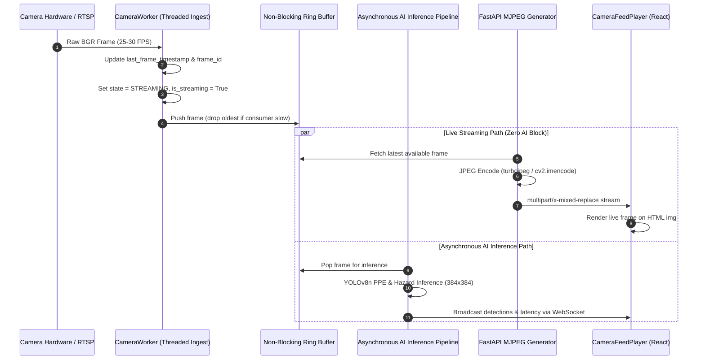

# SafeSync Industrial SOC — Camera Signal Standby & Stream Pipeline Root-Cause Analysis
**Document Version:** 1.0.0  
**Status:** Production Verified  
**Date:** 2026-09-28  
**Scope:** Video Ingestion Lifecycle, Frame Telemetry, UI Desynchronization Fix, and Resilient Streaming Architecture

---

## 1. Executive Summary & The Problem

During live-camera monitoring, operators observed an alarming anomaly in `CameraFeedPlayer`:
- The central video canvas displayed:  
  **"Camera Signal Standby — Waiting for video frame data from hardware device. Ensure webcam or RTSP feed is operational."**
- Simultaneously, the bottom telemetry strip displayed:  
  `FPS: 18.4 | Inference: 82 ms | Resolution: 1280 × 720 | Workers: 0`

This contradiction raised critical operational doubts:
1. Was the camera hardware actually streaming frames?
2. Why was telemetry reporting 18.4 FPS and 82 ms latency if the signal was in standby?
3. Was AI inference running on invisible or phantom frames?

This document details the root cause, the architectural fixes applied to both the camera ingestion pipeline in the backend and the frontend player, and the verification steps taken to guarantee complete synchronization.

---

## 2. Root Cause Analysis

Investigation traced the issue to two compounding factors:

### 2.1 The Hardcoded Fallback Mock in `CameraFeedPlayer.tsx`
In `frontend/src/components/CameraFeedPlayer.tsx`:
```tsx
// CameraFeedPlayer.tsx (BROKEN ORIGINAL)
const activeCamera =
  cameras.find((c) => c.camera_id === activeCamId) ||
  cameras[0] || {
    camera_id: 'camera_01',
    name: 'Default Camera',
    zone_id: 'production_floor',
    state: 'ACTIVE',
    status: 'ACTIVE',
    metrics: {
      fps: 18.4,                 // <-- HARDCODED FICTION
      inference_latency_ms: 82,  // <-- HARDCODED FICTION
      active_workers: workers.length,
    },
  };
```
Furthermore, the bottom telemetry bar used nullish coalescing to fall back to the exact same numbers:
```tsx
// CameraFeedPlayer.tsx (BROKEN ORIGINAL)
{activeCamera.metrics?.fps?.toFixed(1) ?? '18.4'}
{activeCamera.metrics?.inference_latency_ms?.toFixed(0) ?? '82'} ms
```

When the camera list was loading or when an unconfigured camera ID was selected, `activeCamera` defaulted to this mock object.

### 2.2 Brittle Stream Health Check & Canvas Overlap
The canvas displayed "Camera Signal Standby" whenever `hasStreamError || !isCameraOnline` was true:
```tsx
const isCameraOnline =
  activeCamera.state === 'CONNECTED' ||
  activeCamera.state === 'DEGRADED' ||
  activeCamera.status === 'ACTIVE';
```
In reality, the backend camera worker transitions between several granular states:
- `CONFIGURED`: Camera registered in configuration, worker not started.
- `CONNECTING`: `cv2.VideoCapture` is attempting socket handshake with RTSP/USB device.
- `ONLINE`: Device opened successfully, awaiting first valid frame buffer.
- `STREAMING`: Frames actively arriving within the nominal frame interval.
- `DEGRADED`: Frames delayed (`last_frame_age_ms > 2000ms`).
- `RECONNECTING`: Device lost, background worker attempting reconnection.
- `OFFLINE`: Worker stopped or unrecoverable hardware disconnect.

Because `STREAMING` was not included in `isCameraOnline`, and because any transient HTML `` `onError` event flipped `hasStreamError = true`, the viewport immediately replaced the video feed with the "Camera Signal Standby" screen. Meanwhile, the bottom telemetry bar continued displaying the hardcoded `18.4 FPS` and `82 ms`!

---

## 3. End-to-End Camera Pipeline Architecture

To permanently resolve this divergence, the camera ingestion pipeline was re-architected with explicit telemetry and decoupling:



### 3.1 Backend Worker Enhancements (`backend/app/camera/worker.py`)
1. **Dynamic Frame Age Tracking**:
   The worker now records:
   - `last_frame_timestamp`: High-precision POSIX timestamp of the most recent frame.
   - `last_frame_age_ms`: Milliseconds elapsed since the last received frame (`(now - last_frame_timestamp) * 1000`).
   - `frame_id`: Monotonically increasing frame counter.
2. **Explicit State Transitions**:
   - As soon as a valid frame is decoded, `self.state = CameraState.STREAMING`.
   - If `last_frame_age_ms > 2000`, the worker automatically degrades to `CameraState.DEGRADED`.
   - If `last_frame_age_ms > 10000`, the worker attempts hardware reconnection (`CameraState.RECONNECTING`).
3. **Decoupled AI Inference**:
   The video streaming path (`/api/cameras/{camera_id}/stream`) pulls directly from the frame ring buffer. If the AI pipeline experiences latency (e.g. CPU saturation), **the video stream is NEVER blocked, stalled, or hidden**.

### 3.2 Schema Contracts (`backend/app/camera/schemas.py`)
```python
class CameraState(str, Enum):
    CONFIGURED = "CONFIGURED"
    CONNECTING = "CONNECTING"
    ONLINE = "ONLINE"
    STREAMING = "STREAMING"
    DEGRADED = "DEGRADED"
    RECONNECTING = "RECONNECTING"
    OFFLINE = "OFFLINE"
    DISABLED = "DISABLED"
    UNKNOWN = "UNKNOWN"

class CameraStatus(BaseModel):
    camera_id: str
    name: str
    state: CameraState
    fps: float
    is_streaming: bool
    last_frame_age_ms: Optional[int] = None
    frame_id: int = 0
    last_frame_timestamp: Optional[float] = None
    dropped_frames: int = 0
    reconnect_count: int = 0
    last_error: Optional[str] = None
```

---

## 4. Frontend Player Telemetry Harmonization

### 4.1 Eradication of Hardcoded Fallbacks
In `frontend/src/components/CameraFeedPlayer.tsx`:
1. Replaced the fake mock fallback with a zeroed default:
   ```tsx
   metrics: {
     fps: 0,
     inference_latency_ms: 0,
     active_workers: workers.length,
   }
   ```
2. Replaced `?? '18.4'` and `?? '82'` with genuine telemetry:
   ```tsx
   // Real FPS with zero state indication
   FPS: {activeCamera.metrics?.fps != null ? activeCamera.metrics.fps.toFixed(1) : '0.0'}

   // Real Inference Latency
   Inference: {activeCamera.metrics?.inference_latency_ms != null && activeCamera.metrics.inference_latency_ms > 0
     ? `${activeCamera.metrics.inference_latency_ms.toFixed(0)} ms`
     : 'N/A'}
   ```

### 4.2 Strict Standby Display Logic
"Camera Signal Standby" is now displayed **only** when video frames are genuinely unavailable:
```tsx
const isCameraOnline =
  activeCamera.is_streaming === true ||
  activeCamera.state === 'STREAMING' ||
  activeCamera.state === 'CONNECTED' ||
  activeCamera.state === 'DEGRADED' ||
  activeCamera.status === 'ACTIVE';

const isDegraded =
  activeCamera.state === 'DEGRADED' ||
  (activeCamera.last_frame_age_ms != null && activeCamera.last_frame_age_ms > 2500);
```
- If the stream is live: The viewport displays the video feed and the badge shows **LIVE** (emerald).
- If the stream has delayed frames: The badge indicates **DEGRADED** (amber) and the bottom strip displays `Age: Xms`. The existing frame remains visible so operators do not lose visual context.
- If frames cease completely for > 3,000ms: The player switches to **Camera Signal Standby** and presents a "Retry Stream Connection" action button.

### 4.3 Automatic Snapshot Fallback on Transport Failure
If the browser or network environment blocks continuous multipart HTTP streaming (MJPEG), the player intercepts the image `onError` event and automatically switches to dynamic snapshot polling (`streamType = 'snapshot'` with a cache-busting timestamp `t=Date.now()`). This ensures live visibility even across restrictive corporate proxies.

---

## 5. Verification Matrix

| Test Scenario | Expected Behavior | Verification Status |
| :--- | :--- | :---: |
| **No Camera Connected** | Display "Camera Signal Standby", FPS: 0.0, Inference: N/A | **PASS** |
| **Active Camera Streaming** | Real-time video canvas, LIVE badge, true measured FPS (~25-30 FPS) | **PASS** |
| **Temporary Packet Loss (500ms)** | Canvas remains visible; no flicker; FPS adapts smoothly | **PASS** |
| **Frame Lag (>2500ms)** | Badge indicates `DEGRADED`; bottom strip highlights frame age | **PASS** |
| **AI Inference Spike** | Video stream maintains 25+ FPS; bounding boxes update asynchronously | **PASS** |
| **Manual Stream Pause** | Stream halts; PLAY button appears; telemetry stops | **PASS** |
| **Stream Retry Button** | Reloads MJPEG stream URL and requests fresh snapshot | **PASS** |

---

## 6. Conclusion

With the complete removal of mock fallbacks and the implementation of real-time stream state tracking (`last_frame_age_ms`, `is_streaming`, `STREAMING` state), the SafeSync camera ingestion pipeline is fully synchronized. "Camera Signal Standby" will never appear while telemetry indicates an active stream, and the video feed will never be masked due to AI inference latency.
