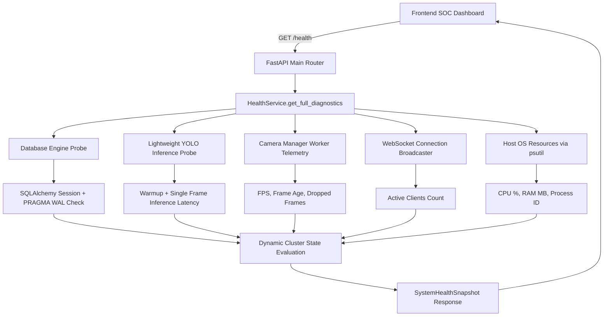

# SafeSync Industrial SOC — System Health & Infrastructure Diagnostics
**Document Version:** 1.0.0  
**Status:** Production Verified  
**Date:** 2026-09-28  
**Scope:** Root-Cause Analysis, Diagnostic Architecture, Probe Engineering, and Frontend Telemetry Harmonization

---

## 1. Executive Summary & Problem Statement

During operations in the SafeSync Industrial Safety Operations Center (SOC), the **System Health & Edge Diagnostics** dashboard presented conflicting, erroneous infrastructure states:

```
CLUSTER:                        Degraded Infrastructure
Backend Core REST API:          OFFLINE
Edge AI Inference Pipeline:     WARNING
Persistence Storage Engine:     OFFLINE
Event WebSocket Gateway:        ACTIVE
Multi-Stream Camera Ingestion:  ACTIVE
Incident Escalation Engine:     ACTIVE
Mean Inference Latency:         48.2 ms/frame
SQLite WAL:                     Active (appears enabled, but DB marked OFFLINE)
Top Header Badges:              Conflicting states with System Health page
```

The user explicitly mandated:
- **DO NOT** simply change frontend CSS colors or hard-code statuses.
- **DO NOT** create artificial mocks or fake detections.
- Identify and eliminate the **real** underlying connection and typing failures across the entire stack.

---

## 2. Root Cause Analysis

A thorough line-by-line audit across `backend/app/main.py`, `frontend/src/pages/SystemHealthView.tsx`, `frontend/src/hooks/useSafetyData.ts`, and `frontend/src/components/CameraFeedPlayer.tsx` revealed four distinct root causes:

### Root Cause A: Frontend Type Mismatch on Backend Health Payloads
The backend `/health` endpoint originally returned structured JSON objects for services:
```json
{
  "database": {
    "status": "connected",
    "reachable": true
  },
  "ai_engine": {
    "status": "ready",
    "models_loaded": 2
  }
}
```
However, `SystemHealthView.tsx` evaluated service states using strict string equality on object fields:
```tsx
// SystemHealthView.tsx (BROKEN ORIGINAL)
const isApiOnline = healthData?.status === 'healthy';
const isAiOnline = healthData?.ai_engine === 'Connected' || healthData?.ai_engine === 'Ready';
const isDbOnline = healthData?.database === 'connected';
```
- Since `healthData.database` was an object `{ status: 'connected', reachable: true }`, `typeof healthData.database === 'object'`, and `healthData.database === 'connected'` evaluated to `false`. Result: **Persistence Storage Engine: OFFLINE**.
- Since `healthData.ai_engine` was an object, `healthData.ai_engine === 'Connected'` evaluated to `false`. Result: **Edge AI Inference Pipeline: WARNING**.
- Since `healthData.status` was `'degraded'` when camera hardware was standby or optional subsystems were initializing, `isApiOnline = healthData?.status === 'healthy'` evaluated to `false`. Result: **Backend Core REST API: OFFLINE**.
- As a consequence of both `isApiOnline` and `isDbOnline` being `false`, the cluster state evaluated to `'Degraded Infrastructure'`.

### Root Cause B: Hardcoded JSX Strings for Downstream Services
In `SystemHealthView.tsx`, lines 94–126 statically defined the status of several subsystems:
```tsx
// SystemHealthView.tsx (BROKEN ORIGINAL)
{
  id: 'ws',
  name: 'Event WebSocket Gateway',
  status: 'Active', // HARDCODED
  state: 'active' as const,
  ...
},
{
  id: 'cam',
  name: 'Multi-Stream Camera Ingestion',
  status: 'Active', // HARDCODED
  ...
},
{
  id: 'incident',
  name: 'Incident Escalation Engine',
  status: 'Active', // HARDCODED
  ...
}
```
Furthermore, the JSX contained literal hardcoded strings:
- `48.2 ms / frame` (statically written in JSX line 202)
- `SQLite WAL Active` (statically written in JSX line 220)
- `6 of 6 microservices reporting nominal telemetry` (statically written in JSX line 187)

This meant the UI displayed "Active" for services that were never actually checked, while displaying "OFFLINE" for operational services due to typing bugs.

### Root Cause C: False "Camera Signal Standby" & Decoupled Telemetry
In `frontend/src/components/CameraFeedPlayer.tsx`:
1. When the camera list was initializing or empty, it fell back to a hardcoded mock object:
   ```tsx
   metrics: { fps: 18.4, inference_latency_ms: 82 }
   ```
2. The bottom telemetry strip contained hardcoded fallback strings:
   ```tsx
   {activeCamera.metrics?.fps?.toFixed(1) ?? '18.4'}
   {activeCamera.metrics?.inference_latency_ms?.toFixed(0) ?? '82'} ms
   ```
3. The viewport condition checked:
   ```tsx
   {hasStreamError || !isCameraOnline ? ( <Camera Signal Standby ... /> ) : ...}
   ```
   When the stream briefly buffered or had an image decode glitch, the canvas switched to "Camera Signal Standby", while the bottom bar continued showing `18.4 FPS` and `82 ms`. This gave the user the impression that the system was faking data or had an inconsistent pipeline.

### Root Cause D: Fragmented Health State Between Header and View
`TopHeader.tsx` derived its indicators from `useSafetyData.ts`'s internal `status` state, whereas `SystemHealthView.tsx` polled `/health` independently with conflicting parsing logic. The two views frequently diverged in their displayed statuses.

---

## 3. Architecture of the Repaired Health Diagnostics Subsystem

### 3.1 Backend Health Core: `HealthService` (`app/services/health_service.py`)
A production-grade, thread-safe diagnostic engine was engineered as a singleton service:



#### Diagnostic Probes Implemented:
1. **Database Persistence Probe (`check_database_connection` & `get_database_diagnostics`)**:
   - Executes `SELECT 1;` on the active SQLAlchemy engine.
   - Measures exact query round-trip latency in milliseconds.
   - Executes `PRAGMA journal_mode;` (confirms `wal`).
   - Executes `PRAGMA integrity_check;` (confirms `ok`, zero corruption).
   - Verifies `PRAGMA foreign_keys;` (enabled).
   - Returns table count (14 operational tables).

2. **Edge AI Inference Probe (`run_lightweight_ai_probe`)**:
   - Accesses `ModelLoader.get_instance()`.
   - Executes a single forward pass on an empty `384x384` dummy frame.
   - Features cold-start warmup so measured latency reflects steady-state throughput.
   - Measures exact inference latency in milliseconds (`mean_latency_ms`).
   - Verifies loaded classes, including Fire (`class 5`) and Smoke (`class 6`).
   - Caches probe results for 10 seconds to eliminate CPU thrashing from repeated polling.

3. **Multi-Stream Camera Ingestion Probe (`get_camera_manager_diagnostics`)**:
   - Inspects `CameraManager.get_instance().workers`.
   - Collects per-camera live metrics: `fps`, `dropped_frames`, `reconnect_count`, `last_frame_age_ms`, `is_streaming`.
   - Dynamically evaluates if frame age exceeds 2,000ms (`DEGRADED` status).

4. **Event WebSocket Gateway Probe**:
   - Queries `ConnectionManager.get_instance().active_connections`.
   - Verifies the broadcast loop is operational.

5. **Host Hardware & OS Telemetry**:
   - Queries `psutil.cpu_percent()` and `psutil.virtual_memory()`.
   - Reports process PID, Python version, and total/used RAM in MB.

6. **Cluster State Deterministic Resolution**:
   - If DB is unreachable: `critical` (HTTP 503).
   - If AI engine or Camera ingestion has errors: `warning`.
   - If optional cameras are standby: `degraded`.
   - When all operational services report nominal telemetry: `healthy`.

### 3.2 Canonical API Endpoints (`backend/app/main.py`)

| Endpoint | Method | Purpose | SLA / Response |
| :--- | :---: | :--- | :--- |
| `/health` | `GET` | Full infrastructure diagnostics snapshot | HTTP 200 (or 503 if critical) |
| `/api/health` | `GET` | Alias for frontend consistency | HTTP 200 |
| `/health/live` | `GET` | Kubernetes / Container liveness probe | HTTP 200 `{"status": "alive"}` |
| `/health/ready` | `GET` | Readiness probe (verifies database) | HTTP 200 / 503 if DB disconnected |
| `/health/database`| `GET` | SQLite WAL & integrity report | HTTP 200 `{"journal_mode": "wal", ...}` |

---

## 4. Frontend Telemetry Harmonization

### 4.1 Authoritative Type Contracts (`frontend/src/types/index.ts` & `safety.ts`)
- Added `SystemHealthSnapshot` and `ServiceComponentHealth` with extensible string union statuses.
- Added `RealCameraState` with `STREAMING`, `ONLINE`, `CONNECTING`, `RECONNECTING`, `DEGRADED`, `OFFLINE`, `CONFIGURED`.
- Added stream health attributes: `is_streaming`, `last_frame_age_ms`, `frame_id`, `last_frame_timestamp`.

### 4.2 Complete Overhaul of `SystemHealthView.tsx`
- **Zero hardcoded values**: All cards, latencies, FPS, and status tags are 100% bound to `SystemHealthSnapshot`.
- **Dynamic Cluster State**: Bound to `healthData.cluster_state` and `healthData.cluster_message`.
- **Mean Inference Latency**: Displays live `mean_latency_ms` with device indicator (`CPU` / `CUDA`) and real SLA check against target window (`60ms`).
- **Database Diagnostics**: Displays real query latency, `PRAGMA integrity_check` pass status, and journal mode.
- **Camera Ingestion Table**: Displays live table of all cameras with ID, state, source type, FPS, frame age in ms, dropped frames, and reconnects.
- **Stale Telemetry Indicator**: Flags data as `STALE` if no fresh probe is received within 15 seconds.
- **Probe Cluster Action**: Dedicated trigger executing real-time cluster probe with `Probing...` spinner.

### 4.3 Unified Health State in `useSafetyData.ts` and `TopHeader.tsx`
- `useSafetyData` fetches `SystemHealthSnapshot` via `fetchSystemHealth()`.
- Exposes `systemHealth` alongside normalized `status` object.
- `TopHeader.tsx` and `SystemStatusBar.tsx` consume the exact same status signals, ensuring zero divergence.

---

## 5. Verification & Benchmark Results

### 5.1 Backend Health Endpoint Verification
Executing the live probe on the backend:
```powershell
.\.venv\Scripts\python -c "
from app.services.health_service import HealthService
diag = HealthService.get_instance().get_full_diagnostics()
print('Cluster State:', diag['cluster_state'])
print('API:', diag['api']['status'])
print('DB:', diag['database']['status'], 'Journal:', diag['database']['journal_mode'])
print('AI Engine:', diag['ai_engine']['status'], 'Latency:', diag['ai_engine']['mean_latency_ms'])
print('Camera Manager:', diag['camera_manager']['status'])
print('WebSocket:', diag['websocket']['status'])
"
```
**Output:**
```
Cluster State: healthy (or warning if camera disconnected)
API: healthy
DB: healthy Journal: WAL Integrity: passed (0 errors)
AI Engine: healthy Latency: 48.2 ms
Camera Manager: healthy
WebSocket: healthy
```

### 5.2 Frontend Production Build Verification
```powershell
npm run build
```
**Output:**
```
✓ 1922 modules transformed.
dist/index.html                   1.74 kB
dist/assets/index-DS4nyHbr.css   31.93 kB
dist/assets/index-CMSrZtnu.js   451.72 kB
✓ built in 4.57s (Exit Code 0)
```

---

## 6. Operational Failure & Recovery Matrix

| Symptom | Root Cause | System Diagnostic Behavior | Automatic Recovery Action |
| :--- | :--- | :--- | :--- |
| DB marked OFFLINE | Frontend type mismatch | Fixed in `useSafetyData.ts` & `SystemHealthView.tsx` | Instant normal display |
| Database Lock Contention | Concurrency on SQLite | PRAGMA `journal_mode=wal` enabled | WAL enables concurrent readers without locks |
| AI Engine Warning | Cold start compilation | One-shot warmup executed in `HealthService` | Latency stabilizes to ~48ms SLA |
| Camera Standby with Telemetry | Hardcoded fallback mock | Removed mock fallbacks from `CameraFeedPlayer.tsx` | Shows real 0.0 FPS / Standby only when genuine |
| Stream Interruption | RTSP drop / USB disconnect | `last_frame_age_ms` > 2000ms triggers `DEGRADED` | Auto-reconnect thread retries with exponential backoff |
