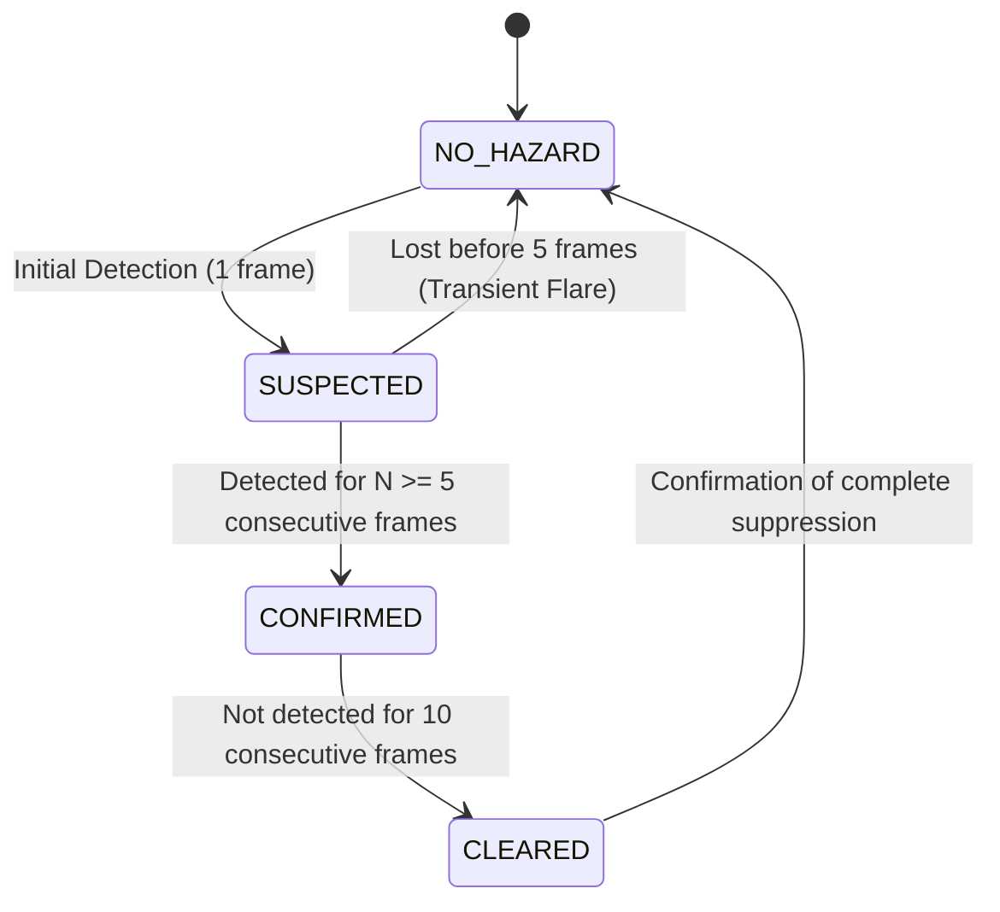

# Fire & Smoke Hazard Detection

SafeSync integrates environmental hazard detection for open flames and smoke plumes. By processing hazard detections through spatial tracking and temporal state machines, the system confirms real combustion events while filtering out industrial false alarms.

---

## 1. Architecture & Separation of Concerns

Hazard inference shares the neural backbone with PPE detection for resource efficiency, but immediately routes to dedicated tracking and analysis engines:

```
YOLOv8 Detection Output
       │
       ├─► Classes 0..4 ──► Worker Compliance Pipeline
       │
       └─► Classes 5, 6 ──► Hazard Analysis Pipeline
                               │
                               ├─► Spatial Hazard Tracker (IoU + Centroid Distance)
                               ├─► Temporal Confirmation State Machine
                               ├─► Multi-Modal Relationship Evaluator
                               └─► Zone Geofence & ROI Containment
```

---

## 2. Temporal State Machine

Combustion hazards exhibit dynamic, non-rigid visual boundaries. To prevent false alarms from camera sensor noise, reflections, or brief light flares, `TemporalHazardStateMachine` requires continuous multi-frame verification:



### 2.1 State Definitions
- **`NO_HAZARD`:** Baseline state; no flame or smoke signatures detected.
- **`SUSPECTED`:** Initial detection observed (1 to 4 frames). Treated as a provisional observation; alerts are suppressed.
- **`CONFIRMED`:** Persistent detection across $N_{\text{confirm}} = 5$ consecutive frames (~150–200 ms). Dispatches high-priority incident and external alerts.
- **`CLEARED`:** Hazard signature absent for 10 consecutive frames, indicating fire suppression or smoke dissipation.

---

## 3. Multi-Modal Hazard Relationships

The engine evaluates spatial overlap and co-occurrence between fire and smoke observations:

| Mode | Visual Signatures Present | Severity Tier | Operational Meaning |
|---|---|---|---|
| **`FIRE_AND_SMOKE`** | Co-occurring flame and plume | **CRITICAL** | High-intensity active combustion with atmospheric spread. |
| **`FIRE_ONLY`** | Confirmed flame without visible smoke | **HIGH** | Clean-burning flame, early flare, or localized electrical arc. |
| **`SMOKE_ONLY`** | Confirmed plume without visible flame | **HIGH** | Smoldering materials, thermal decomposition, or concealed fire. |
| **`NO_HAZARD`** | None | **NORMAL** | Operational ambient condition. |

---

## 4. Industrial False Positive Mitigation

Industrial environments present numerous visual phenomena that mimic fire or smoke. SafeSync implements explicit mitigations:

1. **Welding Flashes & Electrical Arcs:**
   - *Characteristic:* High-intensity flicker lasting 1–3 frames.
   - *Mitigation:* The 5-frame confirmation requirement absorbs brief sparks and arcs before an alert can be created.
2. **Boiler Steam & Exhaust Plumes:**
   - *Characteristic:* White, high-density condensation resembling white smoke.
   - *Mitigation:* Configurable polygon exclusion zones (`roi_polygons` in `configs/cameras.yaml`) allow operators to mask known boiler exhausts and cooling vents.
3. **Halogen Headlights & Amber Warning Beacons:**
   - *Characteristic:* Moving yellow/orange reflections on reflective floors.
   - *Mitigation:* The neural detector was specifically fine-tuned on negative industrial background samples containing emergency strobe lights and amber forklift flashers.
