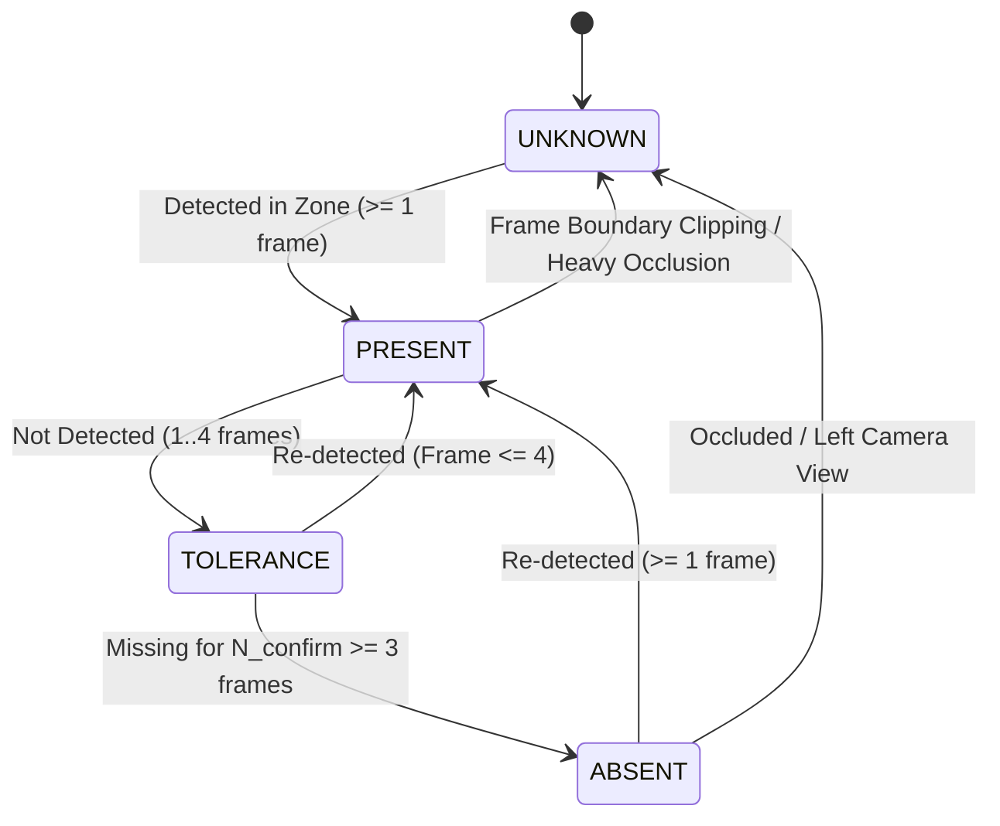

# PPE Compliance & Anatomical Association

In industrial safety monitoring, determining personal protective equipment (PPE) compliance directly through neural classification often results in false alarms caused by partial occlusions, camera angles, and overlapping workers. SafeSync avoids these failure modes through an anatomy-aware spatial association engine combined with a multi-frame temporal state machine.

---

## 1. Anatomical Spatial Association

Rather than relying on global bounding box overlap, `SpatialPPEAssociator` divides each detected worker bounding box ($[x_1, y_1, x_2, y_2]$) into proportional anatomical regions based on standard anthropometric ratios:

```
┌────────────────────────────────────────────────────────┐ 0% (Top of Bounding Box)
│                       HEAD ZONE                        │
│                   Target: HELMET                       │ 25% of Worker Height
├────────────────────────────────────────────────────────┤
│                                                        │
│                       TORSO ZONE                       │
│                Target: SAFETY VEST                     │
│                                                        │ 70% of Worker Height
├──────────────────────────┬─────────────────────────────┤
│       HANDS (LEFT)       │        HANDS (RIGHT)        │
│      Target: GLOVES      │       Target: GLOVES        │ 75% of Worker Height
├──────────────────────────┴─────────────────────────────┤
│                       FEET ZONE                        │
│               Target: SAFETY FOOTWEAR                  │
└────────────────────────────────────────────────────────┘ 100% (Bottom of Box)
```

### 1.1 Zone Matching Rules
1. **Helmet Matching:**
   A detected `helmet` bounding box center must fall within the worker's Head Zone ($y_{\text{center}} \le y_1 + 0.25 \times h$) and horizontal boundaries $[x_1 - 0.1w, x_2 + 0.1w]$.
2. **Safety Vest Matching:**
   A detected `safety_vest` center must fall within the Torso Zone ($y_1 + 0.20h \le y_{\text{center}} \le y_1 + 0.70h$) with horizontal overlap $\ge 40\%$.
3. **Mutual Exclusion:**
   When multiple workers stand close together, each PPE item is assigned to the worker whose anatomical zone centroid exhibits the minimum Euclidean distance. No PPE item can be double-counted.

---

## 2. Temporal State Machine

Single-frame detection dropouts (e.g. head turned sideways for 100 ms) must never trigger an operational alert. `TemporalComplianceTracker` enforces deterministic state transitions:



### 2.1 State Thresholds
- **$N_{\text{confirm}} = 3$ Frames:** A worker must be continuously detected without the required PPE item for 3 consecutive frames before transitioning to confirmed `ABSENT`.
- **$N_{\text{tol}} = 5$ Frames (Tolerance Window):** Once an item is confirmed `PRESENT`, brief dropouts up to 5 frames are absorbed without changing the worker's status to non-compliant.
- **Occlusion Safeguard:** If a worker's head region intersects the edge of the video frame, the state automatically switches to `UNKNOWN`.

---

## 3. Strict Safety Rule: `UNKNOWN != VIOLATION`

A foundational architectural invariant in SafeSync is that **ambiguity is not non-compliance**:

$$\text{UNKNOWN} \neq \text{VIOLATION}$$

1. **Occlusion Handling:** If a worker is partially behind machinery, carrying a pallet, or at the frame boundary, the affected PPE state is marked `UNKNOWN`.
2. **Zero False Violations:** `EventNormalizer` and `AlertEngine` ignore `UNKNOWN` states. Alerts and incidents are created **only** when an item is confirmed `ABSENT`.
3. **Operator Visual Transparency:** The dashboard checklist HUD renders `UNKNOWN` as a neutral gray badge (indicating limited optical visibility) rather than an alarming red non-compliance badge.
