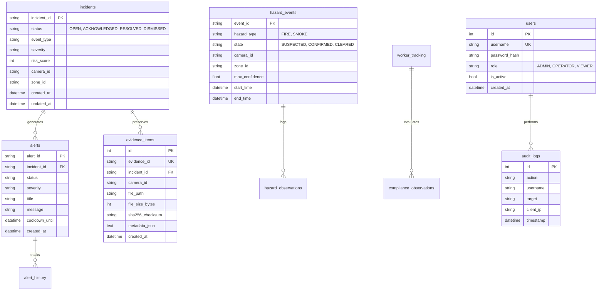

# Database Architecture & Persistence

SafeSync uses a relational database architecture designed for edge reliability, high concurrent throughput, and referential integrity.

---

## 1. Engine & Configuration

The primary persistence store is **SQLite** operating in **Write-Ahead Logging (WAL)** mode via SQLAlchemy ORM.

### 1.1 PRAGMA Directives
Every connection initialized by the application pool hooks directly into SQLite's low-level C API via `@event.listens_for(engine, "connect")` in `backend/app/database/session.py`:

```sql
PRAGMA journal_mode = WAL;
PRAGMA synchronous = NORMAL;
PRAGMA foreign_keys = ON;
PRAGMA busy_timeout = 5000;
```

- **`journal_mode = WAL`**: Readers and writers do not block each other. Multiple background threads (camera workers, API endpoints, WebSocket listeners) read concurrently while a single writer appends changes to the `-wal` file.
- **`synchronous = NORMAL`**: Drastically reduces disk sync overhead without risking database corruption across standard operating system or application crashes.
- **`foreign_keys = ON`**: Strictly enforces relational referential integrity across parent and child entities.
- **`busy_timeout = 5000`**: Contending threads wait up to 5,000 milliseconds for locks to clear before raising errors, eliminating transient edge lock contention.

---

## 2. Relational Schema & Tables



---

## 3. Data Retention & Maintenance Engine

Continuous multi-camera monitoring generates thousands of temporal observations over time. To prevent unbounded disk growth, SafeSync provides a deterministic retention cleanup engine:

```bash
python scripts/cleanup_retention.py --retention-days 30 --mode prune
```

### 3.1 Safety Invariants
1. **Protected Incidents:** Records with status `OPEN` or `ACKNOWLEDGED` are **never deleted**, regardless of age.
2. **Protected Hazards:** Hazards in `SUSPECTED` or `CONFIRMED` states are **never deleted**. Only `CLEARED` events older than the retention threshold are pruned.
3. **Protected Workers:** Worker tracks with `is_active == True` are preserved.
4. **Referential Hierarchy Deletion:** Pruning follows strict foreign key order:
   - `alert_history` $\rightarrow$ `alerts` $\rightarrow$ `incidents`
   - `hazard_observations` $\rightarrow$ `hazard_events`
   - `compliance_observations` $\rightarrow$ `worker_tracking`
5. **Atomic Transactions:** All maintenance operations execute inside atomic database transactions with automatic rollback on error.

### 3.2 Health Verification Endpoint

The active state and PRAGMA settings can be queried via `GET /health/database`:

```json
{
  "status": "healthy",
  "reachable": true,
  "query_ok": true,
  "dialect": "sqlite",
  "database_url": "./safesync.db",
  "tables_available": [
    "incidents",
    "alerts",
    "alert_history",
    "hazard_events",
    "hazard_observations",
    "worker_tracking",
    "evidence_items",
    "users",
    "audit_logs"
  ],
  "expected_tables_found": true,
  "pragmas": {
    "journal_mode": "wal",
    "foreign_keys": 1,
    "busy_timeout": 5000,
    "synchronous": "NORMAL"
  }
}
```
