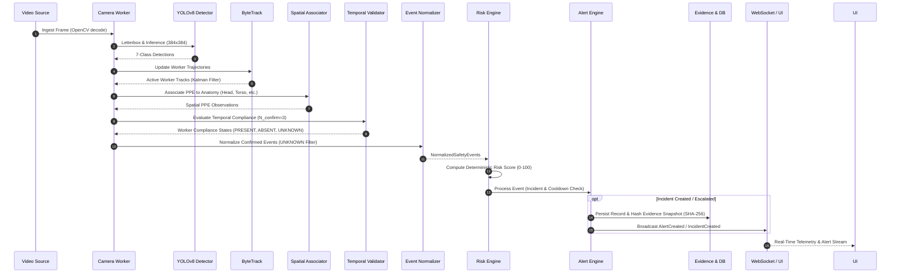

# Processing Pipeline

The SafeSync processing pipeline is a deterministic, multi-stage dataflow designed to convert continuous optical video streams into verified safety intelligence and actionable operator alerts.

---

## 1. Frame Processing Lifecycle

The pipeline operates synchronously on scheduled frames within thread-isolated worker loops. Each frame passes through 12 discrete processing stages:

---

## 2. Detailed Stage Breakdown

### Stage 1: Ingestion & Frame Preprocessing
- **Frame Retrieval:** Decoded from RTSP, USB, or local file via `cv2.VideoCapture` into a BGR NumPy array.
- **Letterboxing:** Preserves aspect ratio while resizing to $384 \times 384 \times 3$ with neutral gray padding.
- **Color Conversion & Normalization:** Converts BGR to RGB and scales pixel values from $[0, 255]$ to $[0.0, 1.0]$.

### Stage 2: YOLO Multi-Task Detection
- **Model Forward Pass:** Ultralytics YOLOv8n single-pass detection.
- **Output Classes:**
  - `person` (0)
  - `helmet` (1), `safety_vest` (2), `gloves` (3), `safety_footwear` (4)
  - `fire` (5), `smoke` (6)
- **Class Routing:** Detections are cleanly partitioned:
  - Persons (class 0) and PPE items (classes 1–4) route to **Worker Compliance**.
  - Fire (class 5) and Smoke (class 6) route to **Hazard Tracking**.

### Stage 3: Multi-Worker Tracking (`ByteTrack`)
- Worker bounding boxes are matched against existing trajectories using an 8-state Kalman Filter ($x, y, a, h, \dot{x}, \dot{y}, \dot{a}, \dot{h}$).
- Two-stage Hungarian association associates high-confidence detections first, followed by low-confidence recoveries to maintain track continuity across partial occlusions.
- Assigns persistent, anonymous integer track IDs (`track_id`).

### Stage 4: Spatial Anatomical PPE Association
- PPE detections are mapped to individual workers based on proportional anatomical regions relative to the worker bounding box:
  - **Head Zone:** Top 0% to 25% of worker height $\rightarrow$ Target for `helmet`.
  - **Torso Zone:** 20% to 70% of worker height $\rightarrow$ Target for `safety_vest`.
  - **Hands Zone:** Lateral regions between 40% and 75% height $\rightarrow$ Target for `gloves`.
  - **Feet Zone:** Bottom 75% to 100% height $\rightarrow$ Target for `safety_footwear`.
- Enforces mutual exclusion: a single PPE item cannot be claimed by multiple overlapping workers.

### Stage 5: Temporal Compliance State Machine
- Single-frame dropouts or momentary glances away must never trigger an alarm.
- **Confirmation Threshold ($N_{\text{confirm}} = 3$):** A PPE item must be consistently undetected across 3 consecutive frames before transitioning from provisional to confirmed `ABSENT`.
- **Tolerance Window ($N_{\text{tol}} = 5$):** Once an item is confirmed `PRESENT`, brief occlusions of up to 5 frames are absorbed before state degradation.
- **Occlusion Handling:** If a worker's head or torso intersects the frame boundary or is occluded by foreground obstacles, the state is classified as `UNKNOWN`.

### Stage 6: Event Normalization
- Converts raw vision states into structured `NormalizedSafetyEvent` envelopes.
- **Strict Rule:** States marked `UNKNOWN` or `PRESENT` **never** generate violations. Only confirmed `ABSENT` PPE triggers violation events (`MISSING_HELMET`, `MISSING_SAFETY_VEST`).

### Stage 7: Deterministic Risk Scoring
- Evaluates event severity on a mathematical $0 \dots 100$ scale:
  $$\text{Risk Score} = \min\left(100, \left(\text{Base Severity} + \text{Persistence Factor} + \text{Worker Density}\right) \times \text{Zone Multiplier}\right)$$
- Maps calculated scores to 4 operational tiers:
  - **LOW (0–29):** Informational advisory.
  - **MEDIUM (30–59):** Operational attention required.
  - **HIGH (60–79):** Priority intervention required.
  - **CRITICAL (80–100):** Immediate emergency response.

### Stage 8: Incident Lifecycle & Alert Cooldown
- **Deduplication:** Aggregates repeated violations from the same worker and camera into an ongoing incident record (`OPEN`).
- **Cooldown Window:** Configurable suppression timer (default 60 seconds) prevents alert notification spamming while non-compliance persists.
- **Persistence Escalation:** If an incident remains unaddressed past the escalation window (default 120 seconds), severity automatically escalates from `MEDIUM` to `HIGH` or `HIGH` to `CRITICAL`.

### Stage 9: Tamper-Evident Evidence Capture
- Captures an annotated JPEG snapshot containing bounding boxes and tracking IDs.
- Computes cryptographic SHA-256 checksum and saves to disk: `outputs/evidence/YYYY/MM/DD/{camera_id}/{incident_id}_{uuid}.jpg`.
- Enforces rolling storage quota limits (default 10 GB) with automatic oldest-first pruning.

### Stage 10: WebSocket & Dashboard Broadcast
- Publishes serialized events via in-memory `EventBroadcaster` pub/sub queue.
- Active WebSocket clients receive real-time JSON payloads updating dashboard badges, camera overlays, and incident feeds within milliseconds.

---

## 3. Latency Budget & Execution Performance

Benchmarked on an Intel 8-core CPU without dedicated GPU acceleration:

| Processing Stage | Target Budget (ms) | Measured Mean (ms) | Status |
|---|---|---|---|
| Frame Ingest & Decode | 10.0 | 4.2 | **Within Budget** |
| Letterboxing & Normalization | 5.0 | 2.1 | **Within Budget** |
| YOLOv8n CPU Forward Pass | 60.0 | 32.8 | **Within Budget** |
| ByteTrack Kalman Update | 8.0 | 2.4 | **Within Budget** |
| Spatial Anatomical Association | 5.0 | 1.1 | **Within Budget** |
| Temporal Compliance Update | 4.0 | 0.8 | **Within Budget** |
| Risk Scoring & Alerting | 5.0 | 1.2 | **Within Budget** |
| WebSocket Serialization | 3.0 | 0.9 | **Within Budget** |
| **Total End-to-End Pipeline** | **< 100.0 ms** | **45.5 ms** | **PASS (22.0 FPS CPU)** |
