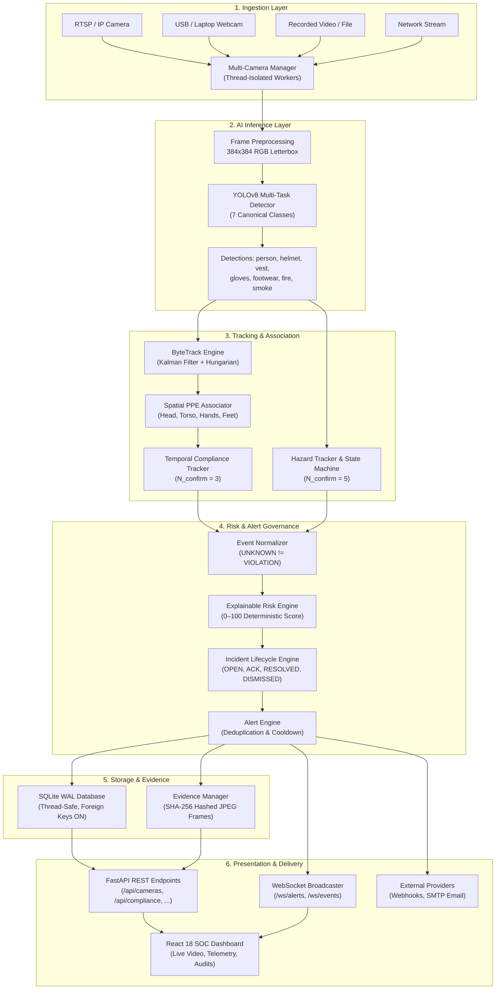

# System Architecture

SafeSync is an automated, edge-ready artificial intelligence safety monitoring system designed for industrial facilities, manufacturing floors, and construction environments. It provides real-time personal protective equipment (PPE) compliance tracking, environmental hazard (fire and smoke) detection, explainable risk scoring, and automated incident management.

---

## 1. Architectural Overview

The system is architected as a decoupled, multi-stage pipeline where physical object detection is strictly separated from spatial tracking, temporal validation, risk calculation, and operational alerting. This separation prevents transient detector noise from creating false alarms and ensures transparent, auditable safety governance.

---

## 2. Core Subsystems

### 2.1 Ingestion Layer
The Ingestion Layer manages video inputs across heterogeneous protocols and physical devices:
- **Multi-Camera Manager (`CameraManager`):** Singleton manager orchestrating concurrent, thread-isolated worker loops (`CameraWorker`).
- **Input Sources:** IP cameras (RTSP/HTTP), USB/laptop webcams (`v4l2` / DirectShow index 0), video files (`.mp4`, `.avi`), and synthetic test patterns.
- **Resilience:** Bounded exponential backoff with configurable retry limits, credential masking in URL strings, and per-camera fault isolation ensuring a failing stream never crashes neighboring workers.

### 2.2 AI Inference Layer
- **Detector:** Ultralytics YOLOv8n single-stage convolutional detector trained on the canonical 7-class safety ontology:
  1. `person` (class 0)
  2. `helmet` (class 1)
  3. `safety_vest` (class 2)
  4. `gloves` (class 3)
  5. `safety_footwear` (class 4)
  6. `fire` (class 5)
  7. `smoke` (class 6)
- **Model Registry:** Cryptographically verified model loading (`ModelLoader`) validating SHA-256 checkpoint hashes before execution.
- **Inference Optimization:** Hardware-aware execution (CUDA when available, CPU fallback) with scheduled inference intervals (`infer_interval_frames = 2`) achieving ~35–42 ms per inference frame.

### 2.3 Tracking & Anatomical Association
- **Worker Tracking (`ByteTrack`):** Multi-object tracker using an 8-state Kalman Filter (`KalmanBoxTracker`) and two-stage Hungarian assignment for persistent, anonymous worker tracking without identity switches.
- **Anatomical Spatial Associator:** Maps detected PPE items to relative human anatomy bounding boxes (Head: top 0–25%, Torso: 20–70%, Hands: mid-lower lateral zones, Feet: bottom 75–100%).
- **Temporal Compliance Validation:** Requires $N_{\text{confirm}} = 3$ consecutive frames before confirming a PPE absence violation, absorbing momentary occlusions and detector flickers.
- **Hazard State Machine:** Decoupled spatial hazard tracker verifying fire and smoke signatures across $N_{\text{confirm}} = 5$ frames (`NO_HAZARD -> SUSPECTED -> CONFIRMED -> CLEARED`).

### 2.4 Governance & Alerting
- **Event Normalizer:** Transforms raw computer vision detections into standardized `NormalizedSafetyEvent` envelopes. Strictly enforces the foundational rule: **`UNKNOWN != VIOLATION`**.
- **Risk Engine:** Computes transparent, deterministic risk scores ($0 \dots 100$) using configurable mathematical weights for base severity, worker count, duration, incident recurrence, and spatial zone risk multipliers.
- **Incident Lifecycle Manager:** Tracks active incidents through verified states: `OPEN` $\rightarrow$ `ACKNOWLEDGED` $\rightarrow$ `RESOLVED` / `DISMISSED`.
- **Smart Alert Engine:** Deduplicates rapid alerts, enforces per-violation cooldown windows, and escalates severity for sustained non-compliance.

### 2.5 Storage & Evidence Layer
- **Relational Persistence:** SQLite database operating in **Write-Ahead Logging (WAL)** mode with thread-safe connection pooling, foreign key constraints (`PRAGMA foreign_keys=ON`), and automated data retention policies.
- **Evidence Manager:** Captures annotated visual snapshots upon incident creation, writes to a structured directory hierarchy (`outputs/evidence/YYYY/MM/DD/{camera_id}/`), computes cryptographic SHA-256 checksums, and manages storage disk quotas.

### 2.6 Presentation & Delivery Layer
- **FastAPI Backend:** High-performance asynchronous REST API exposing camera management, compliance metrics, risk summaries, incident audit logs, and evidence verification endpoints.
- **WebSocket Broadcast Channel:** Bi-directional WebSocket stream (`/ws/alerts`, `/ws/events`) providing live incident feeds and health heartbeats.
- **React 18 SOC Dashboard:** Modern Security Operations Center dashboard built with TypeScript, Vite, and Tailwind CSS. Displays real-time camera grids, worker compliance cards, thermal/hazard indicators, and administrative audit views.
- **External Notification Providers:** Non-blocking dispatch via HTTP Webhooks (with HMAC-SHA256 signatures) and SMTP Email notifications.
