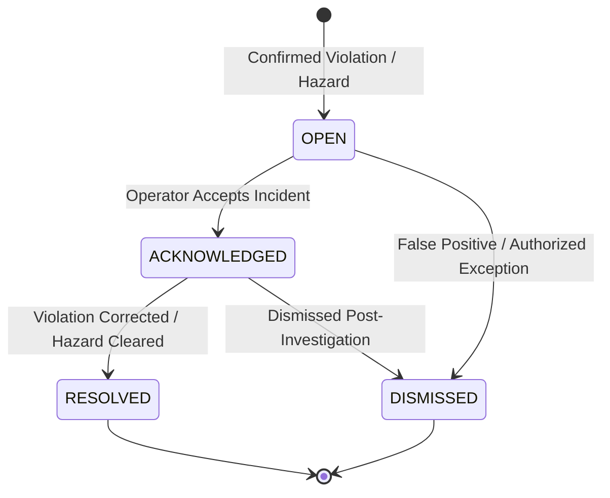

# Incident Management & Operational Governance

SafeSync manages confirmed safety violations and environmental hazards as structured, auditable incident records. Each incident follows a strict lifecycle governed by human-in-the-loop operator actions.

---

## 1. Incident Lifecycle State Machine

### 1.1 State Definitions
- **`OPEN`:** Newly generated incident. Active visual alarm and audible cues on the dashboard.
- **`ACKNOWLEDGED`:** An operator has taken ownership of the incident and initiated corrective action. Visual pulsing stops; incident timer continues.
- **`RESOLVED`:** Safety officer confirms the worker has put on required gear, or hazard sensors verify the flame/smoke has cleared.
- **`DISMISSED`:** Operator closes the incident as an authorized maintenance exception or camera artifact. Mandatory resolution notes are recorded in the audit trail.

---

## 2. Operator REST API Endpoints

All actions require authenticated operator or admin credentials:

| Action | HTTP Request | Description |
|---|---|---|
| **Acknowledge** | `POST /api/alerts/{id}/acknowledge` | Marks linked incident as `ACKNOWLEDGED`. Records operator username and timestamp. |
| **Resolve** | `POST /api/alerts/{id}/resolve` | Closes incident as `RESOLVED`. Requires optional resolution summary. |
| **Dismiss** | `POST /api/alerts/{id}/dismiss` | Closes incident as `DISMISSED`. Requires dismissal justification reason. |
| **List Incidents**| `GET /api/incidents?status=OPEN` | Retrieves active incident records with filtering by status, zone, and severity. |
| **Incident Details**| `GET /api/incidents/{incident_id}` | Retrieves full audit log, attached evidence snapshots, and risk breakdown. |

---

## 3. Human-in-the-Loop Operations

1. **Accountability:** Every state transition records the operator identity, client IP address, and timestamp in the `audit_logs` table.
2. **Non-Destructive Governance:** Incidents can never be deleted through the user interface; all records are retained in compliance with industrial safety audit regulations.
3. **Escalation Warnings:** If an `OPEN` incident is not acknowledged within the configured SLA window (e.g. 5 minutes), the dashboard elevates the visual alert priority and logs an SLA breach event.
